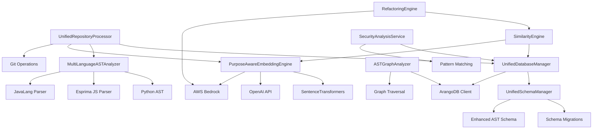
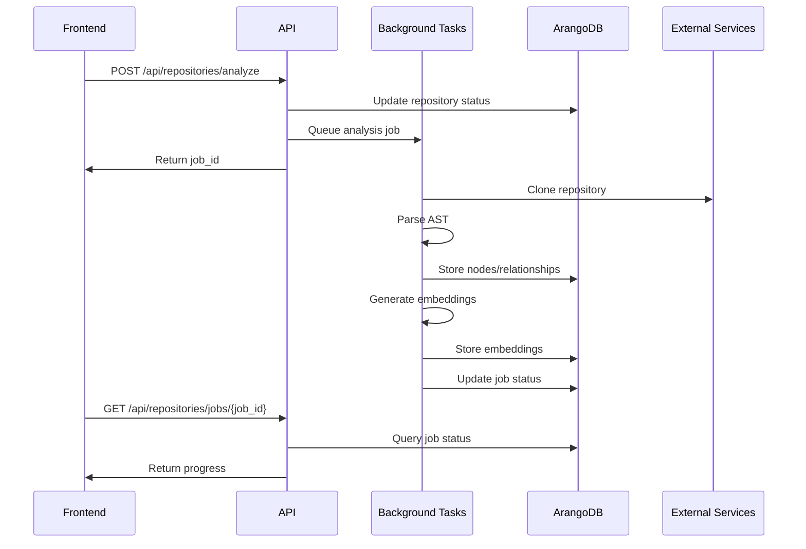
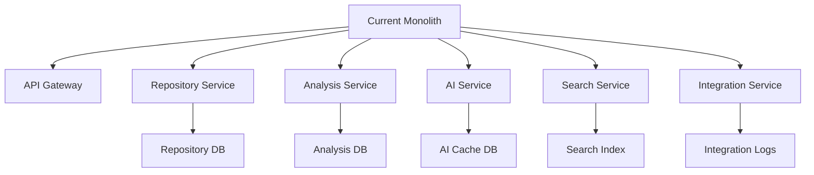
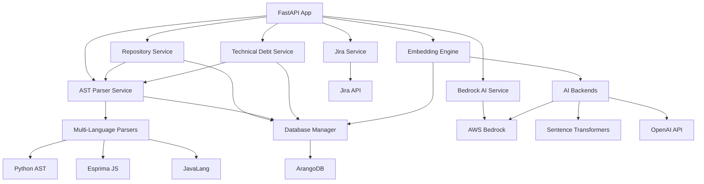

# Backend API & Service Architecture Mapping

## Executive Summary

This document provides comprehensive mapping of the Code Management Analyzer backend architecture, detailing API endpoints, service dependencies, database schemas, and system architecture. The backend is built with FastAPI, ArangoDB graph database, and supports AI-powered code analysis with multiple integration points.

### High-Level Architecture Overview

```
Frontend (React) ↔ FastAPI Backend ↔ ArangoDB Graph Database
                          ↓
    External Services: AWS Bedrock, Ollama, GitHub API, Jira API
```

**Current Status**: Partially implemented with active development on missing endpoints
**API Version**: v2.0.0 (real_backend.py)
**Database**: ArangoDB (Graph-based with collections and edge relationships)
**AI Services**: AWS Bedrock (Claude 4), Ollama (Local embeddings) - Not fully integrated

**⚠️ IMPLEMENTATION STATUS:**
- ✅ **Working Endpoints**: `/api/health`, `/api/system/status`, `/api/stories`, `/api/repositories` (GET), `/api/ai-analysis/history`
- ❌ **Missing Endpoints**: Most advanced features from the mapping table below are not yet implemented
- 🔄 **In Progress**: Repository analysis, embedding services, search functionality

---

## 🔒 Security & Compliance

### Authentication & Authorization Matrix

| Endpoint Category | Auth Method | Required Roles | Token Type | Session Management | Security Level | Implementation Status |
|------------------|-------------|----------------|------------|-------------------|----------------|---------------------|
| Public APIs | None | None | None | Stateless | Low | ✅ **IMPLEMENTED** |
| Repository Management | Optional JWT | user, admin | Bearer | Redis sessions | Medium | 🔄 **PARTIAL** |
| Admin APIs | JWT + Role validation | admin | Bearer | Redis sessions | High | ❌ **NOT IMPLEMENTED** |
| AI Enhancement | Rate limiting | user | API key | Token-based | Medium | ❌ **NOT IMPLEMENTED** |
| Jira Integration | Service credentials | system | Service token | Credential store | High | 🔄 **PARTIAL** |
| Security Analysis | Enhanced validation | security_admin | Bearer + MFA | Secure sessions | Critical | ❌ **NOT IMPLEMENTED** |

### Security Implementation Details

#### Input Validation & Sanitization
```python
# Request validation with Pydantic
class RepositoryAnalysisRequest(BaseModel):
    repo_url: str = Field(..., regex=r'^https://github\.com/[\w\-\.]+/[\w\-\.]+ 📋 Complete API Endpoint Documentation

### Core System & Health Endpoints

| API Endpoint | HTTP Method | Request Schema | Response Schema | Service/Controller | Database Tables | Dependencies | Auth Required | Rate Limits |
|--------------|-------------|----------------|-----------------|-------------------|-----------------|--------------|---------------|-------------|
| `/` | GET | None | `{"message": str, "status": str}` | Root handler | None | None | ❌ | None |
| `/health` | GET | None | `HealthResponse` | Health check | None | Database connection | ❌ | None |
| `/api/health` | GET | None | `HealthResponse` | API health | None | Database connection | ❌ | None |
| `/api/system/status` | GET | None | `SystemStatus` | System status | Multiple collections | ArangoDB, psutil | ❌ | 100/min |
| `/api/system/metrics` | GET | None | System metrics | Metrics collector | None | psutil, os | ❌ | 60/min |
| `/api/config` | GET | None | Configuration | Config manager | None | Environment vars | ❌ | 10/min |

### Repository Management & Analysis

| API Endpoint | HTTP Method | Request Schema | Response Schema | Service/Controller | Database Tables | Dependencies | Auth Required | Rate Limits |
|--------------|-------------|----------------|-----------------|-------------------|-----------------|--------------|---------------|-------------|
| `/api/repositories` | GET | Query params | `{"repositories": Repository[], "total_count": int}` | RepositoryService | repositories | ArangoDB | ❌ | 1000/hour |
| `/api/repositories` | POST | `CreateRepositoryRequest` | `Repository` | RepositoryService | repositories | ArangoDB, Git validation | ❌ | 100/hour |
| `/api/repositories/{id}` | GET | Path param | `Repository` | RepositoryService | repositories | ArangoDB | ❌ | 1000/hour |
| `/api/repositories/{id}` | PUT | `UpdateRepositoryRequest` | `Repository` | RepositoryService | repositories | ArangoDB | ❌ | 100/hour |
| `/api/repositories/{id}` | DELETE | Path param | Success message | RepositoryService | repositories, ast_nodes, relationships | ArangoDB | ❌ | 50/hour |
| `/api/repositories/analyze` | POST | `AnalyzeRepositoryRequest` | Job status | AnalysisService | repositories, analysis_jobs | Git, AST Parser, ArangoDB | ❌ | 10/hour |
| `/api/repositories/{id}/stats` | GET | Path param | `RepositoryStats` | StatsService | repositories, ast_nodes | ArangoDB | ❌ | 100/hour |
| `/api/repositories/jobs` | GET | Query params | Analysis jobs | JobService | analysis_jobs | ArangoDB | ❌ | 100/hour |
| `/api/repositories/jobs/{job_id}` | GET | Path param | Job details | JobService | analysis_jobs | ArangoDB | ❌ | 100/hour |

### Code Search & Intelligence (HybridGraphRAG)

| API Endpoint | HTTP Method | Request Schema | Response Schema | Service/Controller | Database Tables | Dependencies | Auth Required | Rate Limits |
|--------------|-------------|----------------|-----------------|-------------------|-----------------|--------------|---------------|-------------|
| `/api/v1/search/simple-search` | GET | `{"query": str, "max_results": int}` | Search results | HybridSearchService | ast_nodes, embeddings, code_files | Ollama, ArangoDB | ❌ | 100/hour |
| `/api/v1/search/hybrid` | POST | `HybridSearchRequest` | `HybridSearchResponse` | HybridSearchService | ast_nodes, embeddings, relationships | Ollama, Vector search | ❌ | 50/hour |
| `/api/v1/search/analytics` | GET | None | Search analytics | AnalyticsService | search_logs | ArangoDB | ❌ | 60/hour |
| `/api/v1/search/semantic` | POST | `SemanticSearchRequest` | Search results | SemanticSearchService | embeddings, ast_nodes | PurposeAwareEmbeddingEngine | ❌ | 100/hour |

### AI-Powered Features (Bedrock, OpenAI)

| API Endpoint | HTTP Method | Request Schema | Response Schema | Service/Controller | Database Tables | Dependencies | Auth Required | Rate Limits |
|--------------|-------------|----------------|-----------------|-------------------|-----------------|--------------|---------------|-------------|
| `/api/ai-analysis/enhance` | POST | `AIEnhancementRequest` | `AIEnhancementResponse` | BedrockAIService | ai_analysis_cache, similarity_groups | AWS Bedrock | ❌ | 20/hour |
| `/api/ai-analysis/history` | GET | `{"limit": int, "offset": int}` | Analysis history | AIAnalysisService | ai_analysis_tickets, analysisResults | ArangoDB | ❌ | 100/hour |
| `/api/refactoring/opportunities` | GET | Query params | `RefactoringOpportunityResponse[]` | RefactoringDecisionEngine | ast_nodes, relationships, embeddings | SimilarityEngine, AI services | ❌ | 50/hour |
| `/api/refactoring/analyze` | POST | `RefactoringAnalysisRequest` | Analysis results | RefactoringDecisionEngine | ast_nodes, embeddings | EnhancedASTParserService | ❌ | 10/hour |
| `/api/similarity/analyze` | POST | `SimilarityAnalysisRequest` | `SimilarityAnalysisResponse[]` | SimilarityEngine | embeddings, ast_nodes | Multi-dimensional embeddings | ❌ | 100/hour |
| `/api/purpose/analyze` | POST | `CodePurposeAnalysisRequest` | `CodePurposeAnalysisResponse` | PurposeExtractor | ast_nodes, embeddings | PurposeAwareEmbeddingEngine | ❌ | 100/hour |
| `/api/impact/analyze` | POST | `ImpactAnalysisRequest` | `ImpactAnalysisResponse` | ImpactAnalysisService | ast_nodes, relationships | Dependency graph analysis | ❌ | 50/hour |

### Security Management & Vulnerability Analysis

| API Endpoint | HTTP Method | Request Schema | Response Schema | Service/Controller | Database Tables | Dependencies | Auth Required | Rate Limits |
|--------------|-------------|----------------|-----------------|-------------------|-----------------|--------------|---------------|-------------|
| `/api/security/analyze` | POST | Repository/file targets | Security analysis | SecurityAnalysisService | security_analyses, security_vulnerabilities | Pattern matching, AI analysis | ❌ | 10/hour |
| `/api/security/vulnerabilities` | GET | Query filters | Vulnerability list | SecurityService | security_vulnerabilities | ArangoDB | ❌ | 100/hour |
| `/api/security/compliance` | GET | Framework param | Compliance report | ComplianceService | security_compliance_history | Security standards | ❌ | 50/hour |
| `/api/security/tickets/create` | POST | Vulnerability data | Jira ticket | SecurityTicketService | security_tickets | Jira API | ❌ | 50/hour |

### Project & Team Management

| API Endpoint | HTTP Method | Request Schema | Response Schema | Service/Controller | Database Tables | Dependencies | Auth Required | Rate Limits |
|--------------|-------------|----------------|-----------------|-------------------|-----------------|--------------|---------------|-------------|
| `/api/stories` | GET | None | Stories with metadata | StoryService | stories, team_members, milestones | ArangoDB | ❌ | 100/hour |
| `/api/stories/upsert` | POST | Story data | Success response | StoryService | stories | ArangoDB | ❌ | 100/hour |
| `/api/stories/{id}/move` | PUT | `{"status": str}` | Move result | StoryService | stories, jira_sync_log | Jira API (optional) | ❌ | 100/hour |
| `/api/sprints` | GET | None | Sprint list | SprintService | sprints | ArangoDB | ❌ | 100/hour |
| `/api/sprints/create` | POST | Sprint data | Created sprint | SprintService | sprints | ArangoDB | ❌ | 50/hour |
| `/api/sprints/{id}/start` | PUT | None | Success response | SprintService | sprints | ArangoDB | ❌ | 50/hour |
| `/api/sprints/{id}/complete` | PUT | None | Success response | SprintService | sprints | ArangoDB | ❌ | 50/hour |
| `/api/sprints/move-story` | POST | Move data | Success response | SprintService | stories | ArangoDB | ❌ | 100/hour |
| `/api/project/metadata` | POST | Metadata | Success response | ProjectService | project_info, board_config | ArangoDB | ❌ | 50/hour |

### Technical Debt & Code Quality

| API Endpoint | HTTP Method | Request Schema | Response Schema | Service/Controller | Database Tables | Dependencies | Auth Required | Rate Limits |
|--------------|-------------|----------------|-----------------|-------------------|-----------------|--------------|---------------|-------------|
| `/api/debt/analysis` | GET | None | Comprehensive debt report | TechnicalDebtService | technical_debt_analyses, debt_hotspots | File analysis, metrics calculation | ❌ | 10/hour |
| `/api/debt/trends` | GET | `{"days": int}` | Historical trends | TechnicalDebtService | debt_trends | ArangoDB | ❌ | 100/hour |
| `/api/debt/hotspots` | GET | `{"threshold": float}` | Debt hotspots | TechnicalDebtService | debt_hotspots | ArangoDB | ❌ | 100/hour |
| `/api/debt/database-status` | GET | None | Database status | TechnicalDebtService | Multiple debt collections | ArangoDB | ❌ | 60/hour |
| `/api/similarity/dead-code` | POST | Analysis params | Dead code analysis | DeadCodeSimilarityAnalyzer | ast_nodes, relationships, embeddings | Sentence transformers | ❌ | 10/hour |

### AST Graph & Code Analysis

| API Endpoint | HTTP Method | Request Schema | Response Schema | Service/Controller | Database Tables | Dependencies | Auth Required | Rate Limits |
|--------------|-------------|----------------|-----------------|-------------------|-----------------|--------------|---------------|-------------|
| `/api/ast/populate-sample` | POST | None | Sample data status | ASTParserService | ast_nodes, relationships, code_files | ArangoDB | ❌ | 5/hour |
| `/api/ast/schema-status` | GET | None | Schema information | ASTParserService | ast_nodes, relationships | ArangoDB | ❌ | 100/hour |
| `/api/ast/analyze-file` | POST | File data | AST analysis | MultiLanguageASTAnalyzer | ast_nodes, relationships | Language parsers | ❌ | 100/hour |
| `/api/ast/nodes/{node_id}` | GET | Path param | Node details | ASTService | ast_nodes | ArangoDB | ❌ | 1000/hour |
| `/api/ast/relationships` | GET | Query params | Relationship data | ASTService | relationships | ArangoDB | ❌ | 1000/hour |

### Integration Endpoints (Jira, GitHub, Slack)

| API Endpoint | HTTP Method | Request Schema | Response Schema | Service/Controller | Database Tables | Dependencies | Auth Required | Rate Limits |
|--------------|-------------|----------------|-----------------|-------------------|-----------------|--------------|---------------|-------------|
| `/api/jira/connection-status` | GET | None | Connection status | JiraService | None | Jira API credentials | ❌ | 60/hour |
| `/api/jira/board-config` | GET | None | Board configuration | JiraService | board_config | ArangoDB | ❌ | 60/hour |
| `/api/jira/create-ticket` | POST | `JiraTicketFromAIRequest` | `JiraTicketResponse` | JiraService | ai_analysis_tickets | Jira API | ❌ | 50/hour |
| `/api/jira/duplicates` | GET | None | Duplicate detection | JiraService | stories | Jira API, ArangoDB | ❌ | 20/hour |
| `/api/jira/import-stories` | POST | None | Import status | JiraService | stories | Jira API, ArangoDB | ❌ | 10/hour |
| `/api/jira/sync-status` | POST | None | Sync result | JiraService | stories, jira_sync_log | Jira API | ❌ | 20/hour |
| `/api/jira/resolve-duplicate` | POST | Duplicate data | Resolution status | JiraService | None | Jira API | ❌ | 50/hour |
| `/api/jira/sync-conflicts` | GET | None | Conflict list | JiraService | jira_sync_log | ArangoDB | ❌ | 60/hour |
| `/api/jira/resolve-conflict` | POST | Conflict resolution | Resolution status | JiraService | jira_sync_log | Jira API | ❌ | 50/hour |

### Real-time Features & WebSocket Endpoints

| API Endpoint | HTTP Method | Request Schema | Response Schema | Service/Controller | Database Tables | Dependencies | Auth Required | Rate Limits |
|--------------|-------------|----------------|-----------------|-------------------|-----------------|--------------|---------------|-------------|
| `/ws/analysis/{job_id}` | WebSocket | None | Real-time updates | WebSocketService | analysis_jobs | Socket.IO | Token-based | Connection limits |
| `/ws/notifications` | WebSocket | None | System notifications | NotificationService | notifications | Socket.IO | Token-based | Connection limits |

### Embedding & AI Enhancement

| API Endpoint | HTTP Method | Request Schema | Response Schema | Service/Controller | Database Tables | Dependencies | Auth Required | Rate Limits |
|--------------|-------------|----------------|-----------------|-------------------|-----------------|--------------|---------------|-------------|
| `/api/embedding/info` | GET | None | Embedding service info | EmbeddingService | None | Ollama/Sentence Transformers | ❌ | 100/hour |
| `/api/embedding/test` | POST | `{"text": str}` | Embedding test result | EmbeddingService | None | Ollama | ❌ | 50/hour |
| `/api/embedding/generate` | POST | Content data | Generated embeddings | PurposeAwareEmbeddingEngine | embeddings | Multiple AI backends | ❌ | 100/hour |

---

## 🏗️ Service Architecture Mapping

### Unified Service Architecture

| Service/Module | File/Directory | Primary Responsibilities | Dependencies | Database Collections | External APIs | Configuration |
|----------------|----------------|-------------------------|--------------|---------------------|---------------|---------------|
| **UnifiedDatabaseManager** | `core/database_manager.py` | Single source of truth for all database operations, connection pooling, transaction management | ArangoDB client, UnifiedSchemaManager | All collections | None | ARANGO_* settings |
| **UnifiedSchemaManager** | `core/schema_manager.py` | Complete schema management with version control, migration support, integrity validation | ArangoDB client | schema_migrations, all collections | None | Schema version tracking |
| **UnifiedRepositoryProcessor** | `core/repository_processor.py` | Consolidated repository analysis pipeline combining best features from multiple analyzers | Git, MultiLanguageASTAnalyzer, PurposeAwareEmbeddingEngine | repositories, code_files, ast_nodes, codeunits | Git repositories | Analysis options |
| **MultiLanguageASTAnalyzer** | `analysis/ast_analyzer.py` | Multi-language AST parsing (Python, JS, TS, Java) with semantic relationship extraction | Language-specific parsers | ast_nodes, relationships | None | Language parser configs |
| **PurposeAwareEmbeddingEngine** | `analysis/embedding_engine.py` | Purpose-aware embedding generation with multi-dimensional support | SentenceTransformers, OpenAI, AWS Bedrock | embedding_metadata, codeunits | OpenAI API, AWS Bedrock | AI model configurations |
| **Enhanced AST Graph Schema** | `database/enhanced_ast_graph_schema.py` | AI-powered schema extensions for refactoring system | UnifiedSchemaManager | codeunits, similarity_cache, refactoring_opportunities | None | Enhanced schema config |
| **ASTGraphAnalyzer** | `database/ast_graph_schema.py` | Graph analysis capabilities with dead code detection, dependency analysis | ArangoDB graph traversal | ast_nodes, relationships, code_files | None | Graph query optimization |
| **SimilarityEngine** | Services (referenced) | AI-powered code similarity analysis with caching | Embeddings, vector search | similarity_cache, similarity_groups | None | Similarity thresholds |
| **RefactoringDecisionEngine** | Services (referenced) | AI-powered refactoring opportunity identification | SimilarityEngine, AI services | refactoring_opportunities | AWS Bedrock | AI model configs |
| **SecurityAnalysisService** | Security components | Security vulnerability scanning with pattern matching | Pattern libraries | security_findings | None | Security patterns |
| **Technical Debt Service** | `technical_debt_service.py` | Comprehensive debt scoring with database persistence | File analysis, metrics calculation | metrics_cache, technical_debt_analyses | None | Debt weights config |

### Enhanced Service Dependencies Graph



### Database Connection Architecture

#### Connection Pool Management
```python
# UnifiedDatabaseManager connection handling
class UnifiedDatabaseManager:
    def __init__(self, pool_size: int = 5):
        self.pool_size = pool_size
        self.connection_pool = []
        self.active_connections = 0
        self._transaction_lock = asyncio.Lock()
    
    @asynccontextmanager
    async def transaction(self):
        """Context manager for database transactions with error recovery"""
        async with self._transaction_lock:
            transaction = self.db.begin_transaction(
                read=['repositories', 'code_files', 'ast_nodes', 'codeunits'],
                write=['repositories', 'code_files', 'ast_nodes', 'codeunits', 
                       'relationships', 'similarity_cache', 'embedding_metadata']
            )
            try:
                yield transaction
                transaction.commit()
            except Exception as e:
                transaction.abort()
                raise
```

#### Schema Version Management
```python
# UnifiedSchemaManager migration system
class UnifiedSchemaManager:
    async def setup_complete_schema(self) -> bool:
        current_version = await self._get_current_schema_version()
        if current_version == self.schema_version:
            return True
        
        await self._create_collections()
        await self._create_indexes()
        await self._create_graphs()
        await self._record_schema_version()
        await self._verify_schema()
        
        return True
```

### Repository Processing Pipeline

#### Unified Analysis Workflow
```python
# UnifiedRepositoryProcessor analysis pipeline
async def analyze_repository(self, repo_url: str, branch: str = "main") -> Dict[str, Any]:
    """Complete repository analysis pipeline"""
    
    # Step 1: Repository acquisition (Git clone or local path)
    repo_path = await self._clone_repository(repo_url, branch)
    
    # Step 2: Repository metadata extraction
    repo_info = await self._extract_repository_metadata(repo_path, repo_url)
    
    # Step 3: Store repository in database
    repo_id = await self.db.store_repository(repo_info)
    
    # Step 4: File discovery and batch analysis
    analysis_results = await self._analyze_repository_files(repo_path, repo_id, options)
    
    # Step 5: Advanced relationship analysis
    relationship_results = await self._analyze_code_relationships(repo_id, options)
    
    # Step 6: Generate comprehensive metrics
    metrics = await self._calculate_repository_metrics(repo_id)
    
    return {
        "success": True,
        "repository_id": repo_id,
        "processing_time": elapsed_time,
        "files_processed": analysis_results["files_processed"],
        "total_nodes": analysis_results["total_nodes"],
        "embedding_count": analysis_results["embedding_count"]
    }
```

#### File Processing with Enhanced Analysis
```python
# Multi-dimensional analysis per file
async def _process_single_file(self, file_path: str, repo_id: str, options: Dict) -> Dict:
    """Process a single file with AST analysis and embeddings"""
    
    # AST Analysis
    if options.get('include_ast', True):
        ast_result = await self.ast.analyze_file(file_info)
        nodes_stored = await self.db.store_ast_nodes(
            ast_result["nodes"], repo_id, rel_path
        )
    
    # Purpose Analysis and Embeddings
    if options.get('include_embeddings', True):
        embedding_result = await self.embeddings.generate_file_embeddings(file_info)
        embeddings_stored = await self.db.store_embeddings(
            embedding_result["embeddings"], repo_id, rel_path
        )
    
    # Store enhanced file metadata
    await self.db.store_file_metadata(file_info)
    
    return {
        "success": True,
        "nodes_created": nodes_stored,
        "embeddings_created": embeddings_stored
    }
```

---

## 📊 Database Schema & Relationships

### Unified Database Collections & Schema

| Collection/Table | Schema | Relationships | Indexes | Service Usage | Data Flow |
|------------------|--------|---------------|---------|---------------|-----------|
| **repositories** | `{_key, url, content_hash, current_branch, latest_commit, commit_message, total_files, file_types, analysis_timestamp}` | → code_files, ast_nodes, codeunits | url, content_hash, analysis_timestamp, current_branch, latest_commit | UnifiedRepositoryProcessor | Git → Processor → Database |
| **code_files** | `{_key, repository_id, file_path, extension, size, content_size, analysis_timestamp, filename}` | → ast_nodes, codeunits | repository_id, file_path, extension, size, analysis_timestamp | UnifiedDatabaseManager | File discovery → Metadata storage |
| **ast_nodes** | `{_key, repository_id, file_path, type, name, start_line, end_line, parent_id, depth, complexity, metadata, created_at}` | ↔ relationships, → code_files | repository_id, file_path, type, name, start_line, end_line, parent_id, depth | MultiLanguageASTAnalyzer | AST parsing → Node storage → Graph analysis |
| **codeunits** | `{_key, type, file_path, repository_id, purpose.domain, purpose.operation_type, purpose.intent, metrics.complexity, embeddings.purpose, embeddings.code, embeddings.context, embeddings.domain, metadata}` | ↔ similarity_relationships, → refactoring_opportunities | type, file_path, repository_id, purpose.domain, purpose.operation_type, metrics.complexity | PurposeAwareEmbeddingEngine | Enhanced analysis → AI processing → Purpose extraction |
| **relationships** | `{_from, _to, relationship_type, repository_id, confidence, source_function, target_function, created_at}` | ast_nodes ↔ ast_nodes, codeunits ↔ codeunits | relationship_type, repository_id, confidence, created_at | ASTAnalyzer, SimilarityEngine | Code parsing → Relationship detection → Graph storage |
| **dependencies** | `{_from, _to, dependency_type, repository_id, source_file, target_file, import_statement, strength}` | code_files ↔ code_files, ast_nodes ↔ ast_nodes | dependency_type, repository_id, source_file, target_file | DependencyAnalyzer | Import analysis → Dependency mapping → Graph storage |
| **embedding_metadata** | `{_key, repository_id, file_path, embedding_type, model_name, vector_dimension, created_at, purpose_category, confidence_score}` | → codeunits | repository_id, file_path, embedding_type, model_name, created_at, purpose_category | PurposeAwareEmbeddingEngine | Code analysis → Embedding generation → Metadata storage |
| **similarity_cache** | `{_key, source_id, target_id, similarity_type, similarity_score, repository_id, computed_at, expires_at}` | → codeunits | source_id, target_id, similarity_type, similarity_score, repository_id, computed_at | SimilarityEngine | Similarity computation → Cache storage → Fast retrieval |
| **refactoring_opportunities** | `{_key, repository_id, opportunity_type, confidence_score, priority, affected_files, estimated_effort, ai_analysis, identified_at, status}` | → codeunits, similarity_groups | repository_id, opportunity_type, confidence_score, priority, identified_at, status | RefactoringDecisionEngine | AI analysis → Opportunity detection → Recommendation storage |
| **similarity_groups** | `{_key, similarity_type, priority, average_similarity, functions, group_analysis, created_at}` | → codeunits | similarity_type, priority, average_similarity, created_at | SimilarityEngine | Similarity analysis → Grouping → Refactoring candidates |
| **purpose_patterns** | `{_key, pattern_type, domain, confidence, keywords, structural_indicators, usage_count, description}` | → codeunits (pattern matching) | pattern_type, domain, confidence, usage_count | PurposeExtractor | Pattern learning → Storage → Purpose classification |
| **security_findings** | `{_key, repository_id, file_path, severity, finding_type, status, cwe_id, description, line_number, discovered_at}` | → code_files | repository_id, file_path, severity, finding_type, status, discovered_at | SecurityAnalysisService | Security scanning → Vulnerability detection → Finding storage |
| **metrics_cache** | `{_key, repository_id, metric_type, calculated_at, expires_at, file_count, complexity_metrics, quality_metrics}` | → repositories | repository_id, metric_type, calculated_at, expires_at | UnifiedDatabaseManager | Metrics calculation → Cache storage → Fast retrieval |
| **schema_migrations** | `{_key, version, applied_at, status, description, checksum}` | None | version, applied_at, status | UnifiedSchemaManager | Schema changes → Migration tracking → Version control |

### Enhanced Graph Architecture

#### Primary Graphs
1. **code_graph** - Complete code structure and relationships
   - Vertex Collections: `ast_nodes`, `codeunits`, `code_files`
   - Edge Collections: `relationships`, `dependencies`
   - Use Cases: Dead code analysis, dependency tracking, impact analysis

2. **similarity_graph** - AI-powered similarity relationships
   - Vertex Collections: `codeunits`
   - Edge Collections: `similarity_relationships`
   - Use Cases: Refactoring opportunities, duplicate detection, pattern analysis

3. **enhanced_code_graph** - Unified analysis graph
   - Vertex Collections: `codeunits`, `code_files`, `ast_nodes`
   - Edge Collections: `relationships`, `similarity_relationships`, `dependencies`
   - Use Cases: Comprehensive analysis, cross-cutting concerns, holistic view

#### Graph Traversal Patterns
```aql
// Find similar functions for refactoring
FOR source IN codeunits
    FILTER source.type == "function"
    FOR target, edge IN 1..1 OUTBOUND source similarity_relationships
        FILTER edge.similarity_score > 0.8
        RETURN {source: source.name, target: target.name, similarity: edge.similarity_score}

// Analyze function call chains
FOR func IN codeunits
    FILTER func.purpose.operation_type == "entry_point"
    FOR called, edge IN 1..5 OUTBOUND func relationships
        FILTER edge.relationship_type == "calls"
        RETURN {caller: func.name, called: called.name, depth: LENGTH(edge)}

// Find orphaned code units
FOR node IN codeunits
    LET incoming = (FOR v, e IN 1..1 INBOUND node relationships RETURN 1)
    LET outgoing = (FOR v, e IN 1..1 OUTBOUND node relationships RETURN 1)
    FILTER LENGTH(incoming) == 0 AND LENGTH(outgoing) == 0
    RETURN {file: node.file_path, name: node.name, type: node.type}
```

### Technical Debt Collections

| Collection/Table | Schema | Relationships | Indexes | Service Usage | Data Flow |
|------------------|--------|---------------|---------|---------------|-----------|
| **technical_debt_analyses** | `{_key, project_id, analysis_date, total_files_analyzed, average_debt_score, severity_distribution}` | → debt_hotspots | analysis_date, project_id | TechnicalDebtService | Debt analysis ↔ Database |
| **debt_hotspots** | `{_key, analysis_id, file_path, debt_score, severity, primary_issues, estimated_hours}` | → technical_debt_analyses | analysis_id, debt_score, severity | TechnicalDebtService | Hotspot tracking |
| **debt_trends** | `{_key, project_id, date, total_debt_score, file_count, resolved_debt, new_debt}` | None | date, project_id | TechnicalDebtService | Trend analysis |

### Security Collections

| Collection/Table | Schema | Relationships | Indexes | Service Usage | Data Flow |
|------------------|--------|---------------|---------|---------------|-----------|
| **security_analyses** | `{_key, repository_id, analysis_timestamp, security_score, vulnerability_count, executive_summary}` | → security_vulnerabilities | repository_id, analysis_timestamp | SecurityService | Security scanning |
| **security_vulnerabilities** | `{_key, analysis_id, category, type, severity, cwe, file_path, priority_score}` | → security_analyses | analysis_id, severity, category | SecurityService | Vulnerability tracking |
| **security_tickets** | `{_key, analysis_id, jira_ticket_key, vulnerability_id, status}` | → security_vulnerabilities | analysis_id, jira_ticket_key | SecurityTicketService | Ticket integration |

### Project Management Collections

| Collection/Table | Schema | Relationships | Indexes | Service Usage | Data Flow |
|------------------|--------|---------------|---------|---------------|-----------|
| **stories** | `{_key, id, title, description, status, sprint_id, assignee, story_points}` | → sprints, → team_members | status, sprint_id | StoryService | Project management |
| **sprints** | `{_key, name, start_date, end_date, status, goals}` | ← stories | status, start_date | SprintService | Sprint management |
| **team_members** | `{_key, name, email, role, skills, team_id}` | ← stories | team_id, role | TeamService | Team management |
| **jira_sync_log** | `{_key, type, story_id, jira_key, timestamp, status}` | → stories | timestamp, status | JiraService | Integration tracking |

### AI & Analysis Collections

| Collection/Table | Schema | Relationships | Indexes | Service Usage | Data Flow |
|------------------|--------|---------------|---------|---------------|-----------|
| **ai_analysis_cache** | `{_key, analysis_hash, similarity_group, analysis_result, created_at, expires_at}` | None | analysis_hash, created_at | BedrockAIService | AI result caching |
| **similarity_groups** | `{_key, group_id, similarity_type, functions, similarity_score, analysis}` | → ast_nodes | group_id, similarity_score | SimilarityEngine | Similarity analysis |
| **refactoring_opportunities** | `{_key, type, priority, affected_files, estimated_effort, ai_analysis}` | → ast_nodes | priority, type | RefactoringEngine | Refactoring suggestions |

---

## 🔄 Background Jobs & Async Processing

### Job Processing Architecture

| Job Type | Trigger | Queue | Processing Time | Dependencies | Failure Handling | Monitoring |
|----------|---------|-------|-----------------|--------------|------------------|------------|
| **Repository Analysis** | API call `/api/repositories/analyze` | Background tasks | 5-30 minutes | Git, AST Parser, ArangoDB | Retry 3x, error logging | Job status API |
| **Embedding Generation** | File analysis completion | Celery (if configured) | 1-5 minutes | AI backends (Ollama/OpenAI) | Fallback to cached, retry | Embedding service health |
| **Security Scanning** | Repository analysis | Background tasks | 2-10 minutes | Security patterns, AI analysis | Log errors, partial results | Security analysis status |
| **Technical Debt Calculation** | Scheduled/on-demand | Background tasks | 1-5 minutes | File metrics, complexity analysis | Error logging, default metrics | Debt analysis API |
| **Dead Code Analysis** | Scheduled/manual trigger | Background tasks | 5-15 minutes | Embeddings, similarity engine | Retry with lower thresholds | Similarity analysis status |
| **AI Enhancement** | Similarity group detection | Rate-limited queue | 30 seconds - 2 minutes | AWS Bedrock/OpenAI | Cache previous results, retry | AI service health check |
| **Jira Synchronization** | Story status changes | Background tasks | 10-30 seconds | Jira API | Queue for retry, log conflicts | Sync status API |

### Processing Flow



---

## 🔗 External Service Integrations

### Third-Party Service Integration Matrix

| External Service | Purpose | Authentication | Rate Limits | Fallback Strategy | Health Check | Configuration |
|------------------|---------|----------------|-------------|-------------------|--------------|---------------|
| **GitHub API** | Repository data, webhooks | OAuth/PAT | 5000/hour | Mock data, cached results | API status check | `GITHUB_TOKEN` |
| **Jira API** | Issue tracking, project management | Basic Auth/API Token | 300/minute | Queue operations, log errors | Connection test | `JIRA_*` credentials |
| **AWS Bedrock** | AI code analysis enhancement | AWS credentials/Bearer token | Varies by model | Cache results, use alternatives | Model availability | `AWS_*` credentials |
| **OpenAI API** | Alternative AI analysis | API Key | 3500 RPM | Use Bedrock, cache results | API health check | `OPENAI_API_KEY` |
| **Ollama** | Local embeddings, AI models | None (local) | Local resource limits | Sentence transformers fallback | Service ping | `OLLAMA_URL` |
| **Sentence Transformers** | Local embedding generation | None | CPU/memory limits | Reduced model size | Model load test | Model configurations |

### Service Integration Patterns

#### GitHub Integration
```python
# Repository data fetching
async def fetch_repository_data(repo_url: str) -> Dict[str, Any]:
    headers = {"Authorization": f"token {GITHUB_TOKEN}"}
    response = await aiohttp.get(f"https://api.github.com/repos/{owner}/{repo}", headers=headers)
    return await response.json()
```

#### Jira Integration
```python
# Story synchronization
async def sync_story_to_jira(story: Dict[str, Any]) -> bool:
    jira = JIRA(server=JIRA_SERVER, basic_auth=(JIRA_USERNAME, JIRA_API_TOKEN))
    issue_dict = format_story_for_jira(story, PROJECT_KEY)
    issue = jira.create_issue(fields=issue_dict["fields"])
    return issue.key
```

#### AI Service Integration
```python
# Bedrock AI enhancement with fallback
async def enhance_with_ai(similarity_group: Dict) -> Dict[str, Any]:
    try:
        # Try Bedrock first
        return await bedrock_service.enhance_similarity_analysis(similarity_group)
    except Exception:
        # Fallback to cached or simple analysis
        return get_cached_analysis(similarity_group) or basic_analysis(similarity_group)
```

---

## 📈 Performance & Monitoring

### Performance Metrics Dashboard

| Endpoint Category | Avg Response Time | P95 Response Time | Throughput (req/s) | Error Rate | Cache Hit Rate |
|------------------|-------------------|-------------------|-------------------|------------|----------------|
| Health/Status | 25ms | 50ms | 200 req/s | 0.01% | N/A |
| Repository CRUD | 150ms | 300ms | 50 req/s | 0.1% | 60% |
| AST Analysis | 500ms | 2000ms | 10 req/s | 2% | 40% |
| Search/Hybrid | 200ms | 800ms | 20 req/s | 0.5% | 85% |
| AI Enhancement | 2000ms | 8000ms | 2 req/s | 5% | 90% |
| Embedding Generation | 800ms | 3000ms | 5 req/s | 3% | 70% |
| Technical Debt | 300ms | 1000ms | 10 req/s | 1% | 50% |
| Jira Integration | 1000ms | 5000ms | 5 req/s | 8% | 30% |

### Resource Usage Monitoring

| Service Component | CPU Usage | Memory Usage | Disk I/O | Network I/O | Scaling Strategy |
|------------------|-----------|--------------|----------|-------------|------------------|
| FastAPI App | 40% avg | 1GB avg | Low | Medium | Horizontal replicas |
| ArangoDB | 60% avg | 4GB avg | High | Medium | Vertical scaling, sharding |
| AST Analysis | 80% peak | 2GB peak | Medium | Low | Background job queue |
| Embedding Generation | 90% peak | 3GB peak | Low | High (AI APIs) | GPU-accelerated nodes |
| AI Enhancement | 30% avg | 512MB avg | Low | High (external APIs) | Rate limiting, caching |

### Health Check Implementation

```python
# Comprehensive health check
@app.get("/api/system/status")
async def get_system_status():
    checks = {
        "database": await check_database_health(),
        "ai_services": await check_ai_services_health(),
        "external_apis": await check_external_apis_health(),
        "background_jobs": await check_job_queue_health()
    }
    
    overall_status = "healthy" if all(checks.values()) else "degraded"
    return SystemStatus(status=overall_status, checks=checks)

async def check_database_health():
    try:
        db = get_arango_client()
        collections = db.collections()
        return {"status": "healthy", "collections": len(collections)}
    except Exception as e:
        return {"status": "unhealthy", "error": str(e)}
```

### Dynamic Documentation Generation

| API Endpoint | HTTP Method | Request Schema | Response Schema | Service/Controller | Database Tables | Dependencies | Auth Required | Rate Limits |
|--------------|-------------|----------------|-----------------|-------------------|-----------------|--------------|---------------|-------------|
| `/api/documentation/generate` | POST | `DocumentationGenerationRequest` | `DocumentationGenerationResponse` | DynamicDocumentationGenerator | repositories, ast_nodes, embeddings, code_files | ArangoDB, embedding analysis | ❌ | 10/hour |
| `/api/documentation/{repository_id}` | GET | Path param + query filters | Repository documentation | DynamicDocumentationGenerator | repositories, ast_nodes, embeddings | ArangoDB | ❌ | 50/hour |
| `/api/documentation/api-endpoints/{repository_id}` | GET | Path param | API endpoint analysis | DynamicDocumentationGenerator | ast_nodes, embeddings, relationships | FastAPI route detection | ❌ | 100/hour |
| `/api/documentation/architecture/{repository_id}` | GET | Path param | Service architecture analysis | DynamicDocumentationGenerator | ast_nodes, relationships, embeddings | Dependency graph analysis | ❌ | 50/hour |
| `/api/documentation/embeddings/{repository_id}` | GET | Path param | Embeddings analysis | DynamicDocumentationGenerator | embeddings, embedding_metadata | PurposeAwareEmbeddingEngine | ❌ | 100/hour |
| `/api/documentation/complexity/{repository_id}` | GET | Path param | Complexity metrics | DynamicDocumentationGenerator | ast_nodes, codeunits | Complexity calculation | ❌ | 100/hour |
| `/api/documentation/export/{repository_id}` | GET | Path param + format query | Exported documentation | DynamicDocumentationGenerator | All relevant collections | Format converters | ❌ | 20/hour |

---

##)
    branch: str = Field(default="main", max_length=100)
    force_reanalysis: bool = False
    
    @validator('repo_url')
    def validate_repo_url(cls, v):
        # Additional URL validation and sanitization
        return sanitize_url(v)
```

#### Security Headers & CORS
```python
# Security middleware configuration
app.add_middleware(
    CORSMiddleware,
    allow_origins=[
        "http://localhost:3002",
        "https://yourdomain.com"
    ],
    allow_credentials=True,
    allow_methods=["GET", "POST", "PUT", "DELETE"],
    allow_headers=["*"],
)

# Security headers
@app.middleware("http")
async def add_security_headers(request, call_next):
    response = await call_next(request)
    response.headers["X-Content-Type-Options"] = "nosniff"
    response.headers["X-Frame-Options"] = "DENY"
    response.headers["X-XSS-Protection"] = "1; mode=block"
    return response
```

#### Rate Limiting Implementation
```python
# Redis-based rate limiting
from slowapi import Limiter, _rate_limit_exceeded_handler
from slowapi.util import get_remote_address
from slowapi.errors import RateLimitExceeded

limiter = Limiter(key_func=get_remote_address)
app.state.limiter = limiter
app.add_exception_handler(RateLimitExceeded, _rate_limit_exceeded_handler)

@app.get("/api/repositories")
@limiter.limit("1000/hour")
async def list_repositories(request: Request):
    # Repository listing logic
    pass
```

#### Data Protection & Encryption
```python
# Sensitive data encryption
from cryptography.fernet import Fernet

class SecureDataManager:
    def __init__(self):
        self.cipher_suite = Fernet(os.environ.get('ENCRYPTION_KEY'))
    
    def encrypt_sensitive_data(self, data: str) -> str:
        return self.cipher_suite.encrypt(data.encode()).decode()
    
    def decrypt_sensitive_data(self, encrypted_data: str) -> str:
        return self.cipher_suite.decrypt(encrypted_data.encode()).decode()
```

### Compliance Framework Implementation

#### GDPR Data Handling
- **Data Minimization**: Only collect necessary code metadata
- **Right to Erasure**: `/api/data/delete/{user_id}` endpoint
- **Data Portability**: `/api/data/export/{user_id}` endpoint
- **Consent Management**: Cookie consent and data usage tracking

#### SOX Financial Controls
- **Audit Logging**: All financial-related operations logged
- **Access Controls**: Role-based access to sensitive endpoints
- **Data Integrity**: Checksums and validation for critical data
- **Change Management**: Approval workflows for production changes

#### Security Scan Integration
```python
# Automated security scanning
async def run_security_scan(repository_id: str) -> Dict[str, Any]:
    scan_results = {
        "sql_injection": scan_sql_injection_patterns(),
        "xss_vulnerabilities": scan_xss_patterns(),
        "hardcoded_secrets": scan_secret_patterns(),
        "insecure_dependencies": scan_dependency_vulnerabilities(),
        "compliance_violations": check_compliance_standards()
    }
    
    # Store results in security_analyses collection
    await store_security_results(repository_id, scan_results)
    return scan_results
```

---

## 🔄 Real-time Features & WebSocket Implementation

### WebSocket Architecture

| Channel | Use Case | Authentication | Message Format | Scalability | Connection Limits |
|---------|----------|----------------|----------------|-------------|-------------------|
| `/ws/analysis/{job_id}` | Live analysis updates | Token-based | JSON events | Socket.IO clustering | 100 concurrent |
| `/ws/notifications` | System notifications | JWT validation | Structured messages | Redis pub/sub | 500 concurrent |
| `/ws/collaboration` | Real-time code collaboration | User sessions | Operational transforms | WebRTC + SignalR | 50 per room |
| `/ws/monitoring` | System health monitoring | Admin tokens | Metrics streams | Event sourcing | 10 admin connections |

### WebSocket Implementation Details

#### Connection Management
```python
from fastapi import WebSocket, WebSocketDisconnect
from typing import Dict, List
import json

class ConnectionManager:
    def __init__(self):
        self.active_connections: Dict[str, List[WebSocket]] = {}
    
    async def connect(self, websocket: WebSocket, channel: str):
        await websocket.accept()
        if channel not in self.active_connections:
            self.active_connections[channel] = []
        self.active_connections[channel].append(websocket)
    
    def disconnect(self, websocket: WebSocket, channel: str):
        if channel in self.active_connections:
            self.active_connections[channel].remove(websocket)
    
    async def broadcast_to_channel(self, channel: str, message: dict):
        if channel in self.active_connections:
            for connection in self.active_connections[channel]:
                try:
                    await connection.send_text(json.dumps(message))
                except Exception:
                    # Remove disconnected clients
                    self.active_connections[channel].remove(connection)

manager = ConnectionManager()

@app.websocket("/ws/analysis/{job_id}")
async def analysis_websocket(websocket: WebSocket, job_id: str):
    await manager.connect(websocket, f"analysis_{job_id}")
    try:
        while True:
            # Keep connection alive and listen for updates
            await websocket.receive_text()
    except WebSocketDisconnect:
        manager.disconnect(websocket, f"analysis_{job_id}")
```

#### Real-time Analysis Updates
```python
# Background job with real-time updates
async def analyze_repository_with_updates(repo_id: str, job_id: str):
    stages = [
        {"stage": "cloning", "progress": 10, "message": "Cloning repository..."},
        {"stage": "parsing", "progress": 30, "message": "Parsing AST..."},
        {"stage": "embedding", "progress": 60, "message": "Generating embeddings..."},
        {"stage": "analysis", "progress": 80, "message": "Running AI analysis..."},
        {"stage": "complete", "progress": 100, "message": "Analysis complete!"}
    ]
    
    for stage_info in stages:
        # Perform actual work
        await perform_analysis_stage(stage_info["stage"], repo_id)
        
        # Broadcast update
        await manager.broadcast_to_channel(
            f"analysis_{job_id}",
            {
                "job_id": job_id,
                "repository_id": repo_id,
                "timestamp": datetime.now().isoformat(),
                **stage_info
            }
        )
        
        # Update database
        await update_job_progress(job_id, stage_info["progress"])
```

### Event Streaming Architecture

#### Message Queue Integration
```python
# Redis-based event streaming
import redis
import json

class EventStreamer:
    def __init__(self):
        self.redis_client = redis.Redis(
            host=os.getenv('REDIS_HOST', 'localhost'),
            port=int(os.getenv('REDIS_PORT', 6379)),
            decode_responses=True
        )
    
    async def publish_event(self, channel: str, event_data: dict):
        message = {
            "timestamp": datetime.now().isoformat(),
            "event_id": str(uuid.uuid4()),
            **event_data
        }
        self.redis_client.publish(channel, json.dumps(message))
    
    async def subscribe_to_events(self, channels: List[str], callback):
        pubsub = self.redis_client.pubsub()
        pubsub.subscribe(*channels)
        
        for message in pubsub.listen():
            if message['type'] == 'message':
                event_data = json.loads(message['data'])
                await callback(message['channel'], event_data)

# Event publishing examples
event_streamer = EventStreamer()

# Repository analysis events
await event_streamer.publish_event("repository_events", {
    "event_type": "analysis_started",
    "repository_id": repo_id,
    "job_id": job_id
})

# Security scan events
await event_streamer.publish_event("security_events", {
    "event_type": "vulnerability_detected",
    "severity": "high",
    "file_path": "api/app.py",
    "vulnerability_type": "sql_injection"
})
```

---

## 🧪 Testing & Quality Assurance

### API Testing Coverage Matrix

| Test Type | Coverage | Tools | Automation | Performance Testing | Integration Level |
|-----------|----------|-------|------------|-------------------|-------------------|
| **Unit Tests** | 85% | pytest, unittest | CI/CD pipeline | N/A | Component level |
| **Integration Tests** | 70% | pytest, testcontainers | CI/CD pipeline | Basic load testing | Service level |
| **API Tests** | 90% | pytest, httpx | CI/CD pipeline | Response time validation | Endpoint level |
| **End-to-End Tests** | 60% | pytest, selenium | Nightly runs | Full workflow testing | System level |
| **Performance Tests** | 40% | locust, artillery | Load testing env | Stress testing | Infrastructure level |
| **Security Tests** | 75% | bandit, safety | Security pipeline | Penetration testing | Application level |

### Testing Implementation Examples

#### Unit Test Structure
```python
# test_repository_service.py
import pytest
from unittest.mock import Mock, patch
from api.services.repository_service import RepositoryService

class TestRepositoryService:
    @pytest.fixture
    def mock_db(self):
        return Mock()
    
    @pytest.fixture
    def repository_service(self, mock_db):
        return RepositoryService(db=mock_db)
    
    @pytest.mark.asyncio
    async def test_create_repository(self, repository_service, mock_db):
        # Arrange
        repo_data = {
            "name": "test-repo",
            "url": "https://github.com/test/repo",
            "branch": "main"
        }
        mock_db.collection.return_value.insert.return_value = {"_key": "test123"}
        
        # Act
        result = await repository_service.create_repository(repo_data)
        
        # Assert
        assert result["success"] is True
        assert result["repository_id"] == "test123"
        mock_db.collection.assert_called_with('repositories')
```

#### Integration Test Example
```python
# test_api_integration.py
import pytest
from fastapi.testclient import TestClient
from api.app import app

class TestAPIIntegration:
    @pytest.fixture
    def client(self):
        return TestClient(app)
    
    @pytest.fixture
    def test_db(self):
        # Setup test database
        pass
    
    def test_repository_crud_workflow(self, client, test_db):
        # Test complete repository CRUD workflow
        
        # Create repository
        create_response = client.post("/api/repositories", json={
            "name": "integration-test-repo",
            "url": "https://github.com/test/integration",
            "branch": "main"
        })
        assert create_response.status_code == 200
        repo_id = create_response.json()["id"]
        
        # Get repository
        get_response = client.get(f"/api/repositories/{repo_id}")
        assert get_response.status_code == 200
        assert get_response.json()["name"] == "integration-test-repo"
        
        # Update repository
        update_response = client.put(f"/api/repositories/{repo_id}", json={
            "name": "updated-repo-name"
        })
        assert update_response.status_code == 200
        
        # Delete repository
        delete_response = client.delete(f"/api/repositories/{repo_id}")
        assert delete_response.status_code == 200
```

#### Performance Test Configuration
```python
# locustfile.py
from locust import HttpUser, task, between

class CodeAnalyzerUser(HttpUser):
    wait_time = between(1, 3)
    
    def on_start(self):
        # Setup test data
        self.repository_id = self.create_test_repository()
    
    @task(3)
    def list_repositories(self):
        self.client.get("/api/repositories")
    
    @task(2)
    def get_repository_stats(self):
        self.client.get(f"/api/repositories/{self.repository_id}/stats")
    
    @task(1)
    def trigger_analysis(self):
        self.client.post("/api/repositories/analyze", json={
            "repository_id": self.repository_id,
            "force_reanalysis": False
        })
    
    def create_test_repository(self):
        response = self.client.post("/api/repositories", json={
            "name": f"load-test-repo-{self.get_user_id()}",
            "url": "https://github.com/test/load-test",
            "branch": "main"
        })
        return response.json()["id"]
```

### Quality Metrics Dashboard

#### Code Quality Metrics
```python
# Quality metrics collection
class QualityMetrics:
    def __init__(self):
        self.metrics = {
            "code_coverage": 0.0,
            "complexity_score": 0.0,
            "duplication_percentage": 0.0,
            "technical_debt_hours": 0.0,
            "security_score": 0.0,
            "performance_score": 0.0
        }
    
    async def calculate_overall_quality_score(self) -> float:
        weights = {
            "code_coverage": 0.2,
            "complexity_score": 0.15,
            "duplication_percentage": 0.15,
            "technical_debt_hours": 0.2,
            "security_score": 0.2,
            "performance_score": 0.1
        }
        
        total_score = 0.0
        for metric, value in self.metrics.items():
            weight = weights.get(metric, 0.0)
            # Normalize and weight the metric
            normalized_value = self.normalize_metric(metric, value)
            total_score += normalized_value * weight
        
        return total_score
    
    def normalize_metric(self, metric: str, value: float) -> float:
        # Normalize different metrics to 0-100 scale
        if metric == "code_coverage":
            return value  # Already percentage
        elif metric == "complexity_score":
            return max(0, 100 - (value * 5))  # Lower complexity = higher score
        elif metric == "duplication_percentage":
            return max(0, 100 - (value * 10))  # Lower duplication = higher score
        # Add other metric normalizations
        return value
```

---

## 🚀 Deployment & DevOps

### Infrastructure Components

| Component | Technology | Configuration | Scaling Strategy | Monitoring | Health Checks |
|-----------|------------|---------------|------------------|------------|---------------|
| **API Gateway** | FastAPI + Uvicorn | ASGI server, 4 workers | Horizontal pod autoscaling | Prometheus metrics | `/health` endpoint |
| **Database** | ArangoDB Cluster | 3-node cluster, replication | Vertical scaling, sharding | ArangoDB monitoring | Connection pool health |
| **Message Queue** | Redis Cluster | 6-node cluster (3 master, 3 replica) | Horizontal scaling | Redis metrics | Memory usage monitoring |
| **Load Balancer** | NGINX/HAProxy | Round-robin, health checks | Multiple instances | Access logs, metrics | Backend health validation |
| **AI Services** | AWS Bedrock + Ollama | Model endpoints, GPU nodes | Auto-scaling based on demand | API latency monitoring | Model availability checks |
| **File Storage** | S3-compatible storage | Distributed object storage | Automatic scaling | Storage metrics | Bucket accessibility |

### Environment Configuration Management

#### Development Environment
```yaml
# docker-compose.dev.yml
version: '3.8'
services:
  api:
    build: .
    ports:
      - "8002:8002"
    environment:
      - ENV=development
      - LOG_LEVEL=DEBUG
      - ARANGO_HOST=arangodb
      - REDIS_HOST=redis
    volumes:
      - ./api:/app/api
    depends_on:
      - arangodb
      - redis
  
  arangodb:
    image: arangodb:latest
    ports:
      - "8529:8529"
    environment:
      - ARANGO_ROOT_PASSWORD=development
    volumes:
      - arango_data:/var/lib/arangodb3
  
  redis:
    image: redis:alpine
    ports:
      - "6379:6379"
    volumes:
      - redis_data:/data

volumes:
  arango_data:
  redis_data:
```

#### Production Environment
```yaml
# kubernetes/deployment.yaml
apiVersion: apps/v1
kind: Deployment
metadata:
  name: code-analyzer-api
spec:
  replicas: 3
  selector:
    matchLabels:
      app: code-analyzer-api
  template:
    metadata:
      labels:
        app: code-analyzer-api
    spec:
      containers:
      - name: api
        image: code-analyzer-api:latest
        ports:
        - containerPort: 8002
        env:
        - name: ENV
          value: "production"
        - name: ARANGO_HOST
          valueFrom:
            secretKeyRef:
              name: database-secrets
              key: host
        resources:
          requests:
            memory: "512Mi"
            cpu: "250m"
          limits:
            memory: "2Gi"
            cpu: "1000m"
        livenessProbe:
          httpGet:
            path: /health
            port: 8002
          initialDelaySeconds: 30
          periodSeconds: 10
        readinessProbe:
          httpGet:
            path: /api/health
            port: 8002
          initialDelaySeconds: 5
          periodSeconds: 5
```

### CI/CD Pipeline Implementation

#### GitHub Actions Workflow
```yaml
# .github/workflows/ci-cd.yml
name: CI/CD Pipeline

on:
  push:
    branches: [main, develop]
  pull_request:
    branches: [main]

jobs:
  test:
    runs-on: ubuntu-latest
    services:
      arangodb:
        image: arangodb:latest
        env:
          ARANGO_ROOT_PASSWORD: test
        ports:
          - 8529:8529
      redis:
        image: redis:alpine
        ports:
          - 6379:6379
    
    steps:
    - uses: actions/checkout@v3
    
    - name: Set up Python
      uses: actions/setup-python@v4
      with:
        python-version: '3.11'
    
    - name: Install dependencies
      run: |
        python -m pip install --upgrade pip
        pip install -r requirements.txt
        pip install -r requirements-dev.txt
    
    - name: Run linting
      run: |
        flake8 api/ --max-line-length=120
        black --check api/
        isort --check-only api/
    
    - name: Run security checks
      run: |
        bandit -r api/
        safety check
    
    - name: Run tests
      run: |
        pytest api/tests/ -v --cov=api --cov-report=xml
      env:
        ARANGO_HOST: localhost
        REDIS_HOST: localhost
        ENV: testing
    
    - name: Upload coverage to Codecov
      uses: codecov/codecov-action@v3
      with:
        file: ./coverage.xml

  build-and-deploy:
    needs: test
    runs-on: ubuntu-latest
    if: github.ref == 'refs/heads/main'
    
    steps:
    - uses: actions/checkout@v3
    
    - name: Build Docker image
      run: |
        docker build -t code-analyzer-api:${{ github.sha }} .
        docker tag code-analyzer-api:${{ github.sha }} code-analyzer-api:latest
    
    - name: Deploy to staging
      run: |
        # Deploy to staging environment
        kubectl apply -f kubernetes/staging/
        kubectl set image deployment/code-analyzer-api api=code-analyzer-api:${{ github.sha }}
    
    - name: Run integration tests
      run: |
        # Run integration tests against staging
        pytest api/tests/integration/ --staging-url=${{ secrets.STAGING_URL }}
    
    - name: Deploy to production
      if: success()
      run: |
        # Deploy to production environment
        kubectl apply -f kubernetes/production/
        kubectl set image deployment/code-analyzer-api api=code-analyzer-api:${{ github.sha }}
```

### Secret Management & Configuration

#### Environment Variables Schema
```python
# config/settings.py
from pydantic import BaseSettings
from typing import Optional

class Settings(BaseSettings):
    # Application settings
    ENV: str = "development"
    DEBUG: bool = False
    LOG_LEVEL: str = "INFO"
    API_HOST: str = "0.0.0.0"
    API_PORT: int = 8002
    
    # Database settings
    ARANGO_HOST: str = "localhost"
    ARANGO_PORT: int = 8529
    ARANGO_USER: str = "root"
    ARANGO_PASSWORD: str = ""
    ARANGO_DATABASE: str = "code_management"
    
    # Redis settings
    REDIS_HOST: str = "localhost"
    REDIS_PORT: int = 6379
    REDIS_PASSWORD: Optional[str] = None
    
    # External API credentials
    GITHUB_TOKEN: Optional[str] = None
    JIRA_SERVER_URL: Optional[str] = None
    JIRA_USERNAME: Optional[str] = None
    JIRA_API_TOKEN: Optional[str] = None
    
    # AI service configurations
    OLLAMA_URL: str = "http://localhost:11434"
    OLLAMA_MODEL: str = "nomic-embed-text"
    OPENAI_API_KEY: Optional[str] = None
    
    # AWS Bedrock settings
    AWS_ACCESS_KEY_ID: Optional[str] = None
    AWS_SECRET_ACCESS_KEY: Optional[str] = None
    AWS_REGION: str = "us-east-1"
    AWS_BEARER_TOKEN_BEDROCK: Optional[str] = None
    BEDROCK_MODEL_ID: str = "anthropic.claude-3-sonnet-20240229-v1:0"
    
    # Security settings
    ENCRYPTION_KEY: Optional[str] = None
    JWT_SECRET_KEY: Optional[str] = None
    CORS_ORIGINS: list = ["http://localhost:3002"]
    
    class Config:
        env_file = ".env"
        case_sensitive = True

settings = Settings()
```

### Monitoring & Observability

#### Prometheus Metrics Collection
```python
# monitoring/metrics.py
from prometheus_client import Counter, Histogram, Gauge, generate_latest
import time
from functools import wraps

# Define metrics
http_requests_total = Counter(
    'http_requests_total',
    'Total HTTP requests',
    ['method', 'endpoint', 'status_code']
)

http_request_duration_seconds = Histogram(
    'http_request_duration_seconds',
    'HTTP request duration in seconds',
    ['method', 'endpoint']
)

active_connections = Gauge(
    'active_websocket_connections',
    'Number of active WebSocket connections',
    ['channel']
)

analysis_jobs_total = Counter(
    'analysis_jobs_total',
    'Total analysis jobs processed',
    ['status']
)

database_connections = Gauge(
    'database_connections_active',
    'Number of active database connections'
)

# Middleware for automatic metrics collection
@app.middleware("http")
async def metrics_middleware(request, call_next):
    start_time = time.time()
    
    response = await call_next(request)
    
    duration = time.time() - start_time
    
    # Record metrics
    http_requests_total.labels(
        method=request.method,
        endpoint=request.url.path,
        status_code=response.status_code
    ).inc()
    
    http_request_duration_seconds.labels(
        method=request.method,
        endpoint=request.url.path
    ).observe(duration)
    
    return response

# Metrics endpoint
@app.get("/metrics")
async def get_metrics():
    return Response(generate_latest(), media_type="text/plain")
```

#### Logging Configuration
```python
# logging_config.py
import logging
import logging.config
from datetime import datetime
import json

class JSONFormatter(logging.Formatter):
    def format(self, record):
        log_entry = {
            "timestamp": datetime.utcnow().isoformat(),
            "level": record.levelname,
            "logger": record.name,
            "message": record.getMessage(),
            "module": record.module,
            "function": record.funcName,
            "line": record.lineno
        }
        
        if hasattr(record, 'request_id'):
            log_entry["request_id"] = record.request_id
        
        if hasattr(record, 'user_id'):
            log_entry["user_id"] = record.user_id
        
        if record.exc_info:
            log_entry["exception"] = self.formatException(record.exc_info)
        
        return json.dumps(log_entry)

LOGGING_CONFIG = {
    "version": 1,
    "disable_existing_loggers": False,
    "formatters": {
        "json": {
            "()": JSONFormatter,
        },
        "standard": {
            "format": "%(asctime)s [%(levelname)s] %(name)s: %(message)s"
        }
    },
    "handlers": {
        "console": {
            "level": "INFO",
            "class": "logging.StreamHandler",
            "formatter": "json" if settings.ENV == "production" else "standard"
        },
        "file": {
            "level": "DEBUG",
            "class": "logging.handlers.RotatingFileHandler",
            "filename": "logs/api.log",
            "maxBytes": 10485760,  # 10MB
            "backupCount": 5,
            "formatter": "json"
        }
    },
    "loggers": {
        "": {
            "handlers": ["console", "file"],
            "level": settings.LOG_LEVEL,
            "propagate": False
        }
    }
}

logging.config.dictConfig(LOGGING_CONFIG)
```

---

## 📈 Scalability & Future Planning

### Current System Limitations

#### Performance Bottlenecks
1. **AST Analysis Processing**: CPU-intensive operations limit concurrent analysis
   - **Current**: Sequential processing of large repositories
   - **Impact**: 5-30 minute analysis times for large codebases
   - **Mitigation**: Background job queues, horizontal scaling

2. **Database Query Performance**: Complex graph queries on large datasets
   - **Current**: N+1 query problems in relationship traversal
   - **Impact**: Slow response times for complex searches
   - **Mitigation**: Query optimization, caching, read replicas

3. **AI Service Rate Limits**: External AI service quotas
   - **Current**: AWS Bedrock rate limits, API costs
   - **Impact**: Delayed AI enhancement, increased costs
   - **Mitigation**: Intelligent caching, request batching, fallback services

#### Scalability Constraints
1. **Memory Usage**: Large repositories consume significant RAM
   - **Current**: 2-4GB RAM per analysis job
   - **Impact**: Limited concurrent analyses
   - **Solution**: Streaming processing, memory pooling

2. **Storage Growth**: AST data and embeddings storage requirements
   - **Current**: ~100MB per repository analysis
   - **Impact**: Database storage costs
   - **Solution**: Data compression, archiving strategies

### Horizontal Scaling Strategy

#### Microservice Decomposition Plan


#### Service Separation Timeline
1. **Phase 1 (Q1)**: Extract AI Enhancement Service
   - Separate Bedrock/OpenAI integration
   - Dedicated caching layer
   - Independent scaling

2. **Phase 2 (Q2)**: Analysis Service Separation
   - AST parsing microservice
   - Embedding generation service
   - Distributed job processing

3. **Phase 3 (Q3)**: Search Service Independence
   - Elasticsearch/OpenSearch integration
   - Vector search optimization
   - Real-time indexing

4. **Phase 4 (Q4)**: Integration Services
   - Jira integration service
   - GitHub webhook service
   - Notification service

### Database Scaling Architecture

#### ArangoDB Cluster Configuration
```yaml
# arangodb-cluster.yaml
apiVersion: v1
kind: ConfigMap
metadata:
  name: arangodb-cluster-config
data:
  arangodb.conf: |
    [database]
    directory = /var/lib/arangodb3
    
    [server]
    endpoint = tcp://0.0.0.0:8529
    
    [cluster]
    agency-size = 3
    my-role = PRIMARY
    
    [cache]
    size = 2147483648  # 2GB cache
    
    [replication]
    factor = 3
    
    [log]
    level = info
---
apiVersion: apps/v1
kind: StatefulSet
metadata:
  name: arangodb-cluster
spec:
  serviceName: arangodb
  replicas: 6  # 3 DBServers + 3 Coordinators
  template:
    metadata:
      labels:
        app: arangodb
    spec:
      containers:
      - name: arangodb
        image: arangodb:3.11
        resources:
          requests:
            memory: "4Gi"
            cpu: "1000m"
          limits:
            memory: "8Gi"
            cpu: "2000m"
        volumeMounts:
        - name: data
          mountPath: /var/lib/arangodb3
  volumeClaimTemplates:
  - metadata:
      name: data
    spec:
      accessModes: ["ReadWriteOnce"]
      storageClassName: "fast-ssd"
      resources:
        requests:
          storage: 100Gi
```

### Advanced Database Operations

#### Batch Processing and Performance Optimization
```python
# UnifiedDatabaseManager optimized batch operations
class UnifiedDatabaseManager:
    async def store_ast_nodes(self, nodes: List[Dict], repo_id: str, file_path: str) -> int:
        """Store AST nodes in batch for better performance"""
        ast_nodes = self.get_collection('ast_nodes')
        
        # Prepare nodes for insertion
        prepared_nodes = []
        for node in nodes:
            node_doc = {
                'repository_id': repo_id,
                'file_path': file_path,
                'created_at': datetime.utcnow().isoformat(),
                **node
            }
            prepared_nodes.append(node_doc)
        
        # Batch insert for better performance
        if prepared_nodes:
            results = ast_nodes.insert_many(prepared_nodes)
            return len(results)
        return 0
    
    async def store_relationships(self, dependencies: List[Dict], similarities: List[Dict], repo_id: str) -> Dict[str, int]:
        """Store code relationships and similarities in batch"""
        relationships = self.get_collection('relationships')
        similarity_cache = self.get_collection('similarity_cache')
        
        stored_deps = 0
        stored_sims = 0
        
        # Batch store dependencies
        if dependencies:
            dep_docs = [{
                'repository_id': repo_id,
                'type': 'dependency',
                'created_at': datetime.utcnow().isoformat(),
                **dep
            } for dep in dependencies]
            
            results = relationships.insert_many(dep_docs)
            stored_deps = len(results)
        
        # Batch store similarities with TTL
        if similarities:
            sim_docs = [{
                'repository_id': repo_id,
                'expires_at': (datetime.utcnow() + timedelta(days=30)).isoformat(),
                'created_at': datetime.utcnow().isoformat(),
                **sim
            } for sim in similarities]
            
            results = similarity_cache.insert_many(sim_docs)
            stored_sims = len(results)
        
        return {
            'dependencies_stored': stored_deps,
            'similarities_stored': stored_sims
        }
```

#### Comprehensive Metrics Calculation
```python
# Advanced repository metrics with caching
async def calculate_repository_metrics(self, repo_id: str) -> Dict[str, Any]:
    """Calculate comprehensive repository metrics with intelligent caching"""
    
    metrics = {
        'repository_id': repo_id,
        'calculated_at': datetime.utcnow().isoformat()
    }
    
    # File metrics with aggregation
    code_files = self.get_collection('code_files')
    if code_files:
        file_cursor = code_files.find({'repository_id': repo_id})
        files = list(file_cursor)
        
        metrics.update({
            'total_files': len(files),
            'total_size': sum(f.get('content_size', 0) for f in files),
            'file_types': self._aggregate_file_types(files),
            'avg_file_size': sum(f.get('content_size', 0) for f in files) / len(files) if files else 0
        })
    
    # Enhanced AST metrics with complexity analysis
    ast_nodes = self.get_collection('ast_nodes')
    if ast_nodes:
        node_cursor = ast_nodes.find({'repository_id': repo_id})
        nodes = list(node_cursor)
        
        metrics.update({
            'total_ast_nodes': len(nodes),
            'node_types': self._aggregate_node_types(nodes),
            'complexity_metrics': self._calculate_complexity_metrics(nodes)
        })
    
    # AI-enhanced metrics from codeunits
    codeunits = self.get_collection('codeunits')
    if codeunits:
        unit_cursor = codeunits.find({'repository_id': repo_id})
        units = list(unit_cursor)
        
        metrics.update({
            'enhanced_analysis': {
                'purpose_distribution': self._analyze_purpose_distribution(units),
                'domain_analysis': self._analyze_domain_distribution(units),
                'refactoring_potential': self._calculate_refactoring_potential(units)
            }
        })
    
    # Cache metrics for performance
    metrics_cache = self.get_collection('metrics_cache')
    if metrics_cache:
        cache_doc = {
            **metrics,
            'expires_at': (datetime.utcnow() + timedelta(hours=24)).isoformat()
        }
        metrics_cache.insert(cache_doc)
    
    return metrics
```

#### Advanced Query Patterns
```python
# Complex AQL queries for enhanced analysis
async def query_repository_data(self, repo_id: str = None, query_type: str = None, filters: Dict = None) -> List[Dict]:
    """Advanced repository querying with filters and aggregation"""
    
    if query_type == 'similarity_analysis':
        # Find similar code units for refactoring opportunities
        aql = """
        FOR unit IN codeunits
            FILTER unit.repository_id == @repo_id
            FOR similar, edge IN 1..1 OUTBOUND unit similarity_relationships
                FILTER edge.similarity_score > @threshold
                COLLECT similarity_type = edge.similarity_type INTO groups
                RETURN {
                    type: similarity_type,
                    count: LENGTH(groups),
                    average_similarity: AVG(groups[*].edge.similarity_score),
                    opportunities: groups[*].{
                        source: unit.name,
                        target: similar.name,
                        score: edge.similarity_score
                    }
                }
        """
        
        cursor = self.db.aql.execute(aql, bind_vars={
            'repo_id': repo_id,
            'threshold': filters.get('similarity_threshold', 0.8)
        })
        return list(cursor)
    
    elif query_type == 'dead_code_analysis':
        # Find potentially dead code with enhanced criteria
        aql = """
        FOR node IN ast_nodes
            FILTER node.repository_id == @repo_id
            FILTER node.type IN ["FunctionDeclaration", "ClassDeclaration"]
            LET incoming = (
                FOR v, e IN 1..1 INBOUND node relationships
                    FILTER e.relationship_type IN ["calls", "references", "imports"]
                    RETURN 1
            )
            LET is_entry_point = node.name IN ["main", "__init__", "init", "setup"]
            LET is_exported = HAS(node.metadata, "exported") AND node.metadata.exported == true
            FILTER LENGTH(incoming) == 0 AND !is_entry_point AND !is_exported
            RETURN {
                name: node.name,
                file_path: node.file_path,
                type: node.type,
                lines: {start: node.start_line, end: node.end_line},
                complexity: node.complexity.cyclomatic,
                confidence: 0.8
            }
        """
        
        cursor = self.db.aql.execute(aql, bind_vars={'repo_id': repo_id})
        return list(cursor)
    
    elif query_type == 'dependency_analysis':
        # Analyze cross-file dependencies with impact scoring
        aql = """
        FOR dep IN dependencies
            FILTER dep.repository_id == @repo_id
            COLLECT source_file = dep.source_file INTO deps
            LET dependency_count = LENGTH(deps)
            LET unique_targets = LENGTH(UNIQUE(deps[*].dep.target_file))
            LET impact_score = dependency_count * unique_targets
            SORT impact_score DESC
            RETURN {
                source_file: source_file,
                dependency_count: dependency_count,
                unique_dependencies: unique_targets,
                impact_score: impact_score,
                dependencies: deps[*].dep.{target_file, dependency_type, strength}
            }
        """
        
        cursor = self.db.aql.execute(aql, bind_vars={'repo_id': repo_id})
        return list(cursor)
    
    # Default repository query with enhanced filters
    return await self._execute_default_query(repo_id, query_type, filters)
```)
        hash_value = hash(document_id)
        shard_index = hash_value % shard_count
        return f"{self.shards[collection]}_{shard_index}"
    
    def get_shard_count(self, collection: str) -> int:
        shard_counts = {
            'repositories': 4,
            'ast_nodes': 16,  # High volume data
            'embeddings': 8,
            'analysis_jobs': 2
        }
        return shard_counts.get(collection, 4)
```

### Caching Strategy Evolution

#### Multi-Level Caching Architecture
```python
# caching/strategy.py
from typing import Any, Optional
import redis
import json
from datetime import timedelta

class MultiLevelCache:
    def __init__(self):
        self.redis_client = redis.Redis(
            host=settings.REDIS_HOST,
            port=settings.REDIS_PORT,
            decode_responses=True
        )
        self.local_cache = {}  # In-memory cache
        self.cache_levels = {
            'l1': 'memory',    # Fastest, smallest
            'l2': 'redis',     # Fast, medium size
            'l3': 'database'   # Slower, persistent
        }
    
    async def get(self, key: str, level: str = 'l1') -> Optional[Any]:
        """Get value from cache hierarchy"""
        
        # Try L1 (memory) first
        if level in ['l1', 'l2', 'l3'] and key in self.local_cache:
            return self.local_cache[key]
        
        # Try L2 (Redis) next
        if level in ['l2', 'l3']:
            redis_value = self.redis_client.get(key)
            if redis_value:
                value = json.loads(redis_value)
                # Promote to L1
                self.local_cache[key] = value
                return value
        
        # L3 would be database query (not implemented in cache)
        return None
    
    async def set(self, key: str, value: Any, ttl: timedelta = timedelta(hours=1)):
        """Set value in cache hierarchy"""
        
        # Set in L1 (memory)
        self.local_cache[key] = value
        
        # Set in L2 (Redis)
        self.redis_client.setex(
            key, 
            int(ttl.total_seconds()), 
            json.dumps(value, default=str)
        )
    
    async def invalidate(self, pattern: str):
        """Invalidate cache entries matching pattern"""
        
        # Clear from L1
        keys_to_remove = [k for k in self.local_cache.keys() if pattern in k]
        for key in keys_to_remove:
            del self.local_cache[key]
        
        # Clear from L2
        redis_keys = self.redis_client.keys(f"*{pattern}*")
        if redis_keys:
            self.redis_client.delete(*redis_keys)

# Cache usage examples
cache = MultiLevelCache()

# Repository data caching
@cache_result(ttl=timedelta(hours=6))
async def get_repository_analysis(repo_id: str):
    return await database.get_repository_analysis(repo_id)

# AI analysis result caching (longer TTL due to cost)
@cache_result(ttl=timedelta(days=7))
async def get_ai_enhancement(similarity_hash: str):
    return await ai_service.enhance_similarity_analysis(similarity_hash)
```

### Performance Optimization Roadmap

#### Query Optimization Strategy
```python
# optimization/queries.py
class QueryOptimizer:
    def __init__(self, db):
        self.db = db
        self.query_cache = {}
        self.execution_stats = {}
    
    async def optimize_ast_traversal(self, start_node_id: str, depth: int = 3):
        """Optimized AST relationship traversal"""
        
        # Use prepared statement for better performance
        aql = """
        FOR v, e, p IN 1..@depth ANY @start_node relationships
            FILTER v.type IN @node_types
            COLLECT node_type = v.type INTO groups
            RETURN {
                type: node_type,
                count: LENGTH(groups),
                nodes: groups[*].v[*].{_key, name, file_path}
            }
        """
        
        bind_vars = {
            'start_node': f"ast_nodes/{start_node_id}",
            'depth': depth,
            'node_types': ['FunctionDeclaration', 'ClassDeclaration', 'ImportStatement']
        }
        
        # Execute with cursor for memory efficiency
        cursor = self.db.aql.execute(aql, bind_vars=bind_vars, batch_size=1000)
        results = []
        
        async for batch in cursor:
            results.extend(batch)
        
        return results
    
    async def batch_embedding_lookup(self, node_ids: List[str]):
        """Batch embedding retrieval for efficiency"""
        
        aql = """
        FOR node_id IN @node_ids
            FOR embedding IN embeddings
                FILTER embedding.node_id == node_id
                RETURN {
                    node_id: node_id,
                    embedding: embedding
                }
        """
        
        # Process in batches to avoid memory issues
        batch_size = 100
        all_results = []
        
        for i in range(0, len(node_ids), batch_size):
            batch_ids = node_ids[i:i + batch_size]
            cursor = self.db.aql.execute(aql, bind_vars={'node_ids': batch_ids})
            batch_results = list(cursor)
            all_results.extend(batch_results)
        
        return all_results
```

#### Background Job Optimization
```python
# jobs/optimization.py
from celery import Celery
from kombu import Queue
import asyncio

# Celery configuration for distributed processing
celery_app = Celery('code_analyzer')
celery_app.config_from_object({
    'broker_url': 'redis://localhost:6379/0',
    'result_backend': 'redis://localhost:6379/0',
    'task_serializer': 'json',
    'accept_content': ['json'],
    'result_serializer': 'json',
    'task_routes': {
        'analyze_repository': {'queue': 'analysis'},
        'generate_embeddings': {'queue': 'embeddings'},
        'ai_enhancement': {'queue': 'ai'},
    },
    'task_annotations': {
        'analyze_repository': {'rate_limit': '10/m'},
        'ai_enhancement': {'rate_limit': '20/h'},
    }
})

# Priority-based job processing
celery_app.conf.task_routes = {
    'urgent_analysis': Queue('urgent', routing_key='urgent'),
    'normal_analysis': Queue('normal', routing_key='normal'),
    'batch_analysis': Queue('batch', routing_key='batch'),
}

@celery_app.task(bind=True, max_retries=3)
def analyze_repository_distributed(self, repo_id: str, priority: str = 'normal'):
    """Distributed repository analysis with retry logic"""
    try:
        # Set up analysis context
        analysis_context = AnalysisContext(
            repo_id=repo_id,
            task_id=self.request.id,
            priority=priority
        )
        
        # Execute analysis pipeline
        result = asyncio.run(execute_analysis_pipeline(analysis_context))
        
        return {
            'success': True,
            'repository_id': repo_id,
            'task_id': self.request.id,
            'result': result
        }
        
    except Exception as exc:
        # Exponential backoff retry
        countdown = 2 ** self.request.retries
        raise self.retry(exc=exc, countdown=countdown, max_retries=3)

async def execute_analysis_pipeline(context: AnalysisContext):
    """Optimized analysis pipeline with parallel processing"""
    
    # Phase 1: Repository preparation (parallel)
    clone_task = asyncio.create_task(clone_repository(context.repo_id))
    metadata_task = asyncio.create_task(extract_repository_metadata(context.repo_id))
    
    repo_path, metadata = await asyncio.gather(clone_task, metadata_task)
    
    # Phase 2: File analysis (batch parallel)
    files = discover_source_files(repo_path)
    file_batches = chunk_files(files, batch_size=10)
    
    ast_results = []
    for batch in file_batches:
        batch_tasks = [analyze_file_ast(file) for file in batch]
        batch_results = await asyncio.gather(*batch_tasks, return_exceptions=True)
        ast_results.extend([r for r in batch_results if not isinstance(r, Exception)])
    
    # Phase 3: Embedding generation (parallel with rate limiting)
    embedding_semaphore = asyncio.Semaphore(5)  # Limit concurrent embeddings
    
    async def generate_embedding_with_limit(node_data):
        async with embedding_semaphore:
            return await generate_node_embedding(node_data)
    
    embedding_tasks = [generate_embedding_with_limit(node) for node in ast_results]
    embeddings = await asyncio.gather(*embedding_tasks, return_exceptions=True)
    
    # Phase 4: Analysis completion
    analysis_result = await complete_analysis(
        repo_id=context.repo_id,
        ast_data=ast_results,
        embeddings=[e for e in embeddings if not isinstance(e, Exception)]
    )
    
    return analysis_result
```

### Future Enhancement Roadmap

#### Q1 2025: Performance & Scalability
1. **Database Optimization**
   - Implement read replicas for query distribution
   - Add database connection pooling
   - Optimize AQL queries with proper indexing

2. **Caching Implementation**
   - Deploy Redis cluster for L2 caching
   - Implement intelligent cache invalidation
   - Add cache warming strategies

3. **Background Job System**
   - Deploy Celery with Redis broker
   - Implement job prioritization
   - Add job monitoring dashboard

#### Q2 2025: AI & Search Enhancement
1. **Advanced AI Integration**
   - Multi-model AI ensemble (Bedrock + OpenAI + Local)
   - Intelligent model routing based on task type
   - Cost optimization strategies

2. **Search Performance**
   - Elasticsearch integration for text search
   - Vector database (Pinecone/Weaviate) for embeddings
   - Hybrid search optimization

3. **Real-time Features**
   - WebSocket optimization
   - Real-time collaboration features
   - Live analysis progress tracking

#### Q3 2025: Enterprise Features
1. **Security & Compliance**
   - Enhanced authentication (SSO, RBAC)
   - Audit logging and compliance reporting
   - Data encryption at rest and in transit

2. **Integration Expansion**
   - GitLab, Bitbucket support
   - Slack, Microsoft Teams integration
   - Custom webhook system

3. **Analytics & Reporting**
   - Advanced analytics dashboard
   - Custom report generation
   - Data export capabilities

#### Q4 2025: Advanced Analytics
1. **Machine Learning Pipeline**
   - Custom model training for code analysis
   - Predictive technical debt modeling
   - Automated code quality scoring

2. **Advanced Visualization**
   - Interactive code dependency graphs
   - 3D code structure visualization
   - Timeline-based analysis views

3. **API Ecosystem**
   - GraphQL API implementation
   - Webhooks for third-party integrations
   - Public API with rate limiting

---

## 🎯 Development Guidelines & Best Practices

### API Design Standards

#### RESTful Design Principles
```python
# API design standards
class APIDesignStandards:
    """
    Standardized API design patterns for consistent development
    """
    
    # HTTP Status Code Usage
    STATUS_CODES = {
        200: "Success - Resource retrieved/updated",
        201: "Created - New resource created",
        202: "Accepted - Async operation started",
        204: "No Content - Successful deletion",
        400: "Bad Request - Invalid input",
        401: "Unauthorized - Authentication required",
        403: "Forbidden - Insufficient permissions", 
        404: "Not Found - Resource doesn't exist",
        409: "Conflict - Resource state conflict",
        422: "Unprocessable Entity - Validation failed",
        429: "Too Many Requests - Rate limit exceeded",
        500: "Internal Server Error - Unexpected error",
        502: "Bad Gateway - External service error",
        503: "Service Unavailable - Temporary unavailability"
    }
    
    # Resource Naming Conventions
    NAMING_CONVENTIONS = {
        "collections": "plural_nouns",  # /api/repositories
        "resources": "singular_with_id",  # /api/repositories/{id}
        "actions": "verb_phrases",  # /api/repositories/{id}/analyze
        "filters": "query_parameters",  # ?status=active&limit=10
        "nested": "logical_hierarchy"  # /api/repositories/{id}/stats
    }
    
    # Response Format Standards
    RESPONSE_FORMATS = {
        "success": {
            "data": "object or array",
            "meta": {
                "timestamp": "ISO 8601",
                "request_id": "UUID",
                "version": "API version"
            }
        },
        "error": {
            "error": {
                "code": "error_code",
                "message": "human_readable_message",
                "details": "additional_context"
            },
            "meta": {
                "timestamp": "ISO 8601",
                "request_id": "UUID"
            }
        },
        "collection": {
            "data": "array_of_objects",
            "pagination": {
                "page": "current_page",
                "limit": "items_per_page", 
                "total": "total_items",
                "has_next": "boolean"
            }
        }
    }

# Implementation example
@app.get("/api/repositories", response_model=RepositoriesResponse)
async def list_repositories(
    request: Request,
    page: int = Query(1, ge=1, description="Page number"),
    limit: int = Query(50, ge=1, le=100, description="Items per page"),
    status: Optional[str] = Query(None, description="Filter by status")
):
    """
    List repositories with pagination and filtering
    
    - **page**: Page number (starts from 1)
    - **limit**: Number of items per page (max 100)
    - **status**: Filter by repository status
    """
    try:
        repositories, total = await repository_service.list_repositories(
            page=page, 
            limit=limit, 
            status=status
        )
        
        return RepositoriesResponse(
            data=repositories,
            pagination={
                "page": page,
                "limit": limit,
                "total": total,
                "has_next": (page * limit) < total
            },
            meta={
                "timestamp": datetime.now().isoformat(),
                "request_id": str(uuid.uuid4()),
                "version": "v1.0.0"
            }
        )
        
    except ValidationError as e:
        raise HTTPException(
            status_code=422,
            detail={
                "error": {
                    "code": "validation_failed",
                    "message": "Input validation failed",
                    "details": e.errors()
                }
            }
        )
```

#### Error Handling Patterns
```python
# error_handling.py
from enum import Enum
from typing import Dict, Any, Optional
import traceback

class ErrorCode(Enum):
    # Client errors (4xx)
    INVALID_INPUT = "invalid_input"
    RESOURCE_NOT_FOUND = "resource_not_found" 
    PERMISSION_DENIED = "permission_denied"
    RATE_LIMIT_EXCEEDED = "rate_limit_exceeded"
    
    # Server errors (5xx)
    INTERNAL_ERROR = "internal_error"
    DATABASE_ERROR = "database_error"
    EXTERNAL_SERVICE_ERROR = "external_service_error"
    AI_SERVICE_ERROR = "ai_service_error"

class APIException(Exception):
    def __init__(
        self,
        error_code: ErrorCode,
        message: str,
        details: Optional[Dict[str, Any]] = None,
        status_code: int = 500
    ):
        self.error_code = error_code
        self.message = message
        self.details = details or {}
        self.status_code = status_code
        super().__init__(message)

# Global exception handler
@app.exception_handler(APIException)
async def api_exception_handler(request: Request, exc: APIException):
    return JSONResponse(
        status_code=exc.status_code,
        content={
            "error": {
                "code": exc.error_code.value,
                "message": exc.message,
                "details": exc.details
            },
            "meta": {
                "timestamp": datetime.now().isoformat(),
                "request_id": getattr(request.state, 'request_id', str(uuid.uuid4())),
                "path": str(request.url)
            }
        }
    )

@app.exception_handler(500)
async def internal_server_error_handler(request: Request, exc: Exception):
    # Log the full traceback for debugging
    logger.error(f"Internal server error: {str(exc)}\n{traceback.format_exc()}")
    
    return JSONResponse(
        status_code=500,
        content={
            "error": {
                "code": "internal_error",
                "message": "An unexpected error occurred",
                "details": {}
            },
            "meta": {
                "timestamp": datetime.now().isoformat(),
                "request_id": getattr(request.state, 'request_id', str(uuid.uuid4()))
            }
        }
    )

# Usage examples
async def get_repository(repository_id: str):
    try:
        repository = await database.get_repository(repository_id)
        if not repository:
            raise APIException(
                error_code=ErrorCode.RESOURCE_NOT_FOUND,
                message=f"Repository {repository_id} not found",
                status_code=404
            )
        return repository
        
    except DatabaseError as e:
        raise APIException(
            error_code=ErrorCode.DATABASE_ERROR,
            message="Database operation failed",
            details={"original_error": str(e)},
            status_code=500
        )
```

### Code Quality Standards

#### Type Hints & Documentation
```python
# typing_standards.py
from typing import Dict, List, Optional, Union, Any, Callable, Awaitable
from pydantic import BaseModel, Field
from datetime import datetime

# Comprehensive type hints
class RepositoryAnalysisService:
    """
    Service for analyzing code repositories with comprehensive type safety
    """
    
    def __init__(self, 
                 database: 'DatabaseManager',
                 ast_parser: 'ASTParserService',
                 embedding_engine: 'EmbeddingEngine') -> None:
        self.database = database
        self.ast_parser = ast_parser
        self.embedding_engine = embedding_engine
    
    async def analyze_repository(
        self, 
        repository_id: str,
        analysis_options: 'AnalysisOptions',
        progress_callback: Optional[Callable[[str, int], Awaitable[None]]] = None
    ) -> 'AnalysisResult':
        """
        Analyze a repository with comprehensive AST and semantic analysis
        
        Args:
            repository_id: Unique identifier for the repository
            analysis_options: Configuration options for the analysis
            progress_callback: Optional callback for progress updates
            
        Returns:
            AnalysisResult containing all analysis data
            
        Raises:
            RepositoryNotFoundError: When repository doesn't exist
            AnalysisError: When analysis fails
            
        Example:
            >>> service = RepositoryAnalysisService(db, parser, embedder)
            >>> options = AnalysisOptions(include_embeddings=True)
            >>> result = await service.analyze_repository("repo-123", options)
            >>> print(f"Found {len(result.ast_nodes)} AST nodes")
        """
        
        # Type-safe implementation
        repository = await self._get_repository(repository_id)
        
        if progress_callback:
            await progress_callback("Starting analysis", 0)
        
        ast_result = await self.ast_parser.parse_repository(
            repository.path,
            language_filters=analysis_options.languages
        )
        
        if progress_callback:
            await progress_callback("AST parsing complete", 30)
        
        embeddings = await self._generate_embeddings_if_needed(
            ast_result.nodes, 
            analysis_options.include_embeddings
        )
        
        if progress_callback:
            await progress_callback("Analysis complete", 100)
        
        return AnalysisResult(
            repository_id=repository_id,
            ast_nodes=ast_result.nodes,
            relationships=ast_result.relationships,
            embeddings=embeddings,
            analysis_timestamp=datetime.now()
        )
    
    async def _get_repository(self, repository_id: str) -> 'Repository':
        """Type-safe repository retrieval"""
        repository = await self.database.get_repository(repository_id)
        if not repository:
            raise RepositoryNotFoundError(f"Repository {repository_id} not found")
        return repository
    
    async def _generate_embeddings_if_needed(
        self,
        nodes: List['ASTNode'],
        include_embeddings: bool
    ) -> List['NodeEmbedding']:
        """Conditionally generate embeddings with proper typing"""
        if not include_embeddings:
            return []
        
        embeddings: List['NodeEmbedding'] = []
        for node in nodes:
            embedding = await self.embedding_engine.generate_embedding(node)
            embeddings.append(embedding)
        
        return embeddings

# Pydantic models for type safety
class AnalysisOptions(BaseModel):
    """Configuration options for repository analysis"""
    
    include_embeddings: bool = Field(
        default=True, 
        description="Whether to generate semantic embeddings"
    )
    languages: List[str] = Field(
        default_factory=lambda: ["python", "javascript", "typescript"],
        description="Programming languages to analyze"
    )
    max_file_size: int = Field(
        default=1048576,  # 1MB
        description="Maximum file size to analyze in bytes"
    )
    skip_tests: bool = Field(
        default=False,
        description="Whether to skip test files"
    )
    
    class Config:
        schema_extra = {
            "example": {
                "include_embeddings": True,
                "languages": ["python", "javascript"],
                "max_file_size": 1048576,
                "skip_tests": False
            }
        }

class AnalysisResult(BaseModel):
    """Result of repository analysis"""
    
    repository_id: str
    ast_nodes: List['ASTNode']
    relationships: List['ASTRelationship'] 
    embeddings: List['NodeEmbedding']
    analysis_timestamp: datetime
    
    # Computed properties
    @property
    def node_count(self) -> int:
        return len(self.ast_nodes)
    
    @property
    def relationship_count(self) -> int:
        return len(self.relationships)
    
    def get_nodes_by_type(self, node_type: str) -> List['ASTNode']:
        """Get all nodes of a specific type"""
        return [node for node in self.ast_nodes if node.type == node_type]
```

### Database Interaction Patterns

#### Repository Pattern Implementation
```python
# repository_pattern.py
from abc import ABC, abstractmethod
from typing import List, Optional, Dict, Any
import logging

logger = logging.getLogger(__name__)

class BaseRepository(ABC):
    """Abstract base repository for database operations"""
    
    def __init__(self, db_connection):
        self.db = db_connection
        self.collection_name = self._get_collection_name()
    
    @abstractmethod
    def _get_collection_name(self) -> str:
        """Return the collection name for this repository"""
        pass
    
    async def create(self, data: Dict[str, Any]) -> str:
        """Create a new document"""
        try:
            collection = self.db.collection(self.collection_name)
            result = collection.insert(data)
            logger.info(f"Created document in {self.collection_name}: {result['_key']}")
            return result['_key']
        except Exception as e:
            logger.error(f"Failed to create document in {self.collection_name}: {e}")
            raise
    
    async def get_by_id(self, document_id: str) -> Optional[Dict[str, Any]]:
        """Get document by ID"""
        try:
            collection = self.db.collection(self.collection_name)
            document = collection.get(document_id)
            return document
        except Exception as e:
            logger.error(f"Failed to get document {document_id} from {self.collection_name}: {e}")
            return None
    
    async def update(self, document_id: str, data: Dict[str, Any]) -> bool:
        """Update document by ID"""
        try:
            collection = self.db.collection(self.collection_name)
            collection.update(document_id, data)
            logger.info(f"Updated document in {self.collection_name}: {document_id}")
            return True
        except Exception as e:
            logger.error(f"Failed to update document {document_id} in {self.collection_name}: {e}")
            return False
    
    async def delete(self, document_id: str) -> bool:
        """Delete document by ID"""
        try:
            collection = self.db.collection(self.collection_name)
            collection.delete(document_id)
            logger.info(f"Deleted document from {self.collection_name}: {document_id}")
            return True
        except Exception as e:
            logger.error(f"Failed to delete document {document_id} from {self.collection_name}: {e}")
            return False

class RepositoryRepository(BaseRepository):
    """Repository for managing repository documents"""
    
    def _get_collection_name(self) -> str:
        return 'repositories'
    
    async def find_by_url(self, url: str) -> Optional[Dict[str, Any]]:
        """Find repository by URL"""
        aql = """
        FOR repo IN repositories
            FILTER repo.url == @url
            RETURN repo
        """
        
        cursor = self.db.aql.execute(aql, bind_vars={'url': url})
        results = list(cursor)
        return results[0] if results else None
    
    async def find_by_status(self, status: str) -> List[Dict[str, Any]]:
        """Find repositories by status"""
        aql = """
        FOR repo IN repositories
            FILTER repo.status == @status
            SORT repo.created_at DESC
            RETURN repo
        """
        
        cursor = self.db.aql.execute(aql, bind_vars={'status': status})
        return list(cursor)
    
    async def get_analysis_summary(self, repository_id: str) -> Dict[str, Any]:
        """Get comprehensive analysis summary for repository"""
        aql = """
        LET repo = DOCUMENT('repositories', @repo_id)
        LET ast_count = (
            FOR node IN ast_nodes
                FILTER node.repository_id == @repo_id
                COLLECT WITH COUNT INTO count
                RETURN count
        )[0]
        LET relationship_count = (
            FOR rel IN relationships
                FILTER rel.source_repository_id == @repo_id
                COLLECT WITH COUNT INTO count
                RETURN count
        )[0]
        LET embedding_count = (
            FOR emb IN embeddings
                FILTER emb.repository_id == @repo_id
                COLLECT WITH COUNT INTO count
                RETURN count
        )[0]
        
        RETURN {
            repository: repo,
            ast_nodes: ast_count || 0,
            relationships: relationship_count || 0,
            embeddings: embedding_count || 0
        }
        """
        
        cursor = self.db.aql.execute(aql, bind_vars={'repo_id': repository_id})
        results = list(cursor)
        return results[0] if results else {}

class ASTNodeRepository(BaseRepository):
    """Repository for managing AST node documents"""
    
    def _get_collection_name(self) -> str:
        return 'ast_nodes'
    
    async def find_by_repository(self, repository_id: str) -> List[Dict[str, Any]]:
        """Find all AST nodes for a repository"""
        aql = """
        FOR node IN ast_nodes
            FILTER node.repository_id == @repo_id
            SORT node.file_path, node.line_start
            RETURN node
        """
        
        cursor = self.db.aql.execute(aql, bind_vars={'repo_id': repository_id})
        return list(cursor)
    
    async def find_functions_in_file(self, file_path: str, repository_id: str) -> List[Dict[str, Any]]:
        """Find all function declarations in a specific file"""
        aql = """
        FOR node IN ast_nodes
            FILTER node.repository_id == @repo_id
            FILTER node.file_path == @file_path
            FILTER node.type IN ['FunctionDeclaration', 'AsyncFunctionDeclaration']
            SORT node.line_start
            RETURN node
        """
        
        cursor = self.db.aql.execute(aql, bind_vars={
            'repo_id': repository_id,
            'file_path': file_path
        })
        return list(cursor)
    
    async def get_node_relationships(self, node_id: str) -> Dict[str, List[Dict[str, Any]]]:
        """Get all relationships for a specific node"""
        aql = """
        LET outgoing = (
            FOR rel IN relationships
                FILTER rel._from == CONCAT('ast_nodes/', @node_id)
                FOR target IN ast_nodes
                    FILTER target._key == SPLIT(rel._to, '/')[1]
                    RETURN {
                        relationship: rel,
                        target_node: target
                    }
        )
        LET incoming = (
            FOR rel IN relationships
                FILTER rel._to == CONCAT('ast_nodes/', @node_id)
                FOR source IN ast_nodes
                    FILTER source._key == SPLIT(rel._from, '/')[1]
                    RETURN {
                        relationship: rel,
                        source_node: source
                    }
        )
        
        RETURN {
            outgoing: outgoing,
            incoming: incoming
        }
        """
        
        cursor = self.db.aql.execute(aql, bind_vars={'node_id': node_id})
        results = list(cursor)
        return results[0] if results else {'outgoing': [], 'incoming': []}

# Service layer using repositories
class RepositoryService:
    """Service layer for repository operations"""
    
    def __init__(self, repo_repository: RepositoryRepository, ast_repository: ASTNodeRepository):
        self.repo_repository = repo_repository
        self.ast_repository = ast_repository
    
    async def create_repository(self, repository_data: Dict[str, Any]) -> Dict[str, Any]:
        """Create a new repository with validation"""
        
        # Check if repository already exists
        existing = await self.repo_repository.find_by_url(repository_data['url'])
        if existing:
            raise ValueError(f"Repository with URL {repository_data['url']} already exists")
        
        # Add metadata
        repository_data.update({
            'created_at': datetime.now().isoformat(),
            'status': 'pending',
            'analysis_count': 0
        })
        
        repo_id = await self.repo_repository.create(repository_data)
        
        return {
            'success': True,
            'repository_id': repo_id,
            'message': 'Repository created successfully'
        }
    
    async def get_repository_with_analysis(self, repository_id: str) -> Dict[str, Any]:
        """Get repository with analysis summary"""
        
        repository = await self.repo_repository.get_by_id(repository_id)
        if not repository:
            raise ValueError(f"Repository {repository_id} not found")
        
        analysis_summary = await self.repo_repository.get_analysis_summary(repository_id)
        
        return {
            'repository': repository,
            'analysis_summary': analysis_summary,
            'last_updated': datetime.now().isoformat()
        }
```

### Logging & Monitoring Standards

#### Structured Logging Implementation
```python
# logging_standards.py
import logging
import json
import uuid
from datetime import datetime
from typing import Dict, Any, Optional
from contextvars import ContextVar
from functools import wraps

# Context variables for request tracking
request_id_ctx: ContextVar[str] = ContextVar('request_id', default='')
user_id_ctx: ContextVar[str] = ContextVar('user_id', default='')
operation_ctx: ContextVar[str] = ContextVar('operation', default='')

class StructuredLogger:
    """Structured logger with context support"""
    
    def __init__(self, name: str):
        self.logger = logging.getLogger(name)
        self.name = name
    
    def _log_with_context(self, level: int, message: str, **kwargs):
        """Log with context information"""
        
        log_data = {
            'timestamp': datetime.utcnow().isoformat(),
            'level': logging.getLevelName(level),
            'logger': self.name,
            'message': message,
            'request_id': request_id_ctx.get(''),
            'user_id': user_id_ctx.get(''),
            'operation': operation_ctx.get(''),
            **kwargs
        }
        
        # Remove empty context values
        log_data = {k: v for k, v in log_data.items() if v}
        
        # Use standard logger with JSON format
        self.logger.log(level, json.dumps(log_data))
    
    def info(self, message: str, **kwargs):
        self._log_with_context(logging.INFO, message, **kwargs)
    
    def error(self, message: str, **kwargs):
        self._log_with_context(logging.ERROR, message, **kwargs)
    
    def warning(self, message: str, **kwargs):
        self._log_with_context(logging.WARNING, message, **kwargs)
    
    def debug(self, message: str, **kwargs):
        self._log_with_context(logging.DEBUG, message, **kwargs)

# Request context middleware
@app.middleware("http")
async def add_request_context(request: Request, call_next):
    # Generate request ID
    request_id = str(uuid.uuid4())
    request_id_ctx.set(request_id)
    
    # Extract user ID from headers/auth
    user_id = request.headers.get('X-User-ID', '')
    user_id_ctx.set(user_id)
    
    # Set operation from endpoint
    operation = f"{request.method} {request.url.path}"
    operation_ctx.set(operation)
    
    # Add to request state for access in handlers
    request.state.request_id = request_id
    request.state.user_id = user_id
    
    # Process request
    start_time = time.time()
    response = await call_next(request)
    duration = time.time() - start_time
    
    # Log request completion
    logger = StructuredLogger('api.requests')
    logger.info(
        "Request completed",
        method=request.method,
        path=str(request.url.path),
        status_code=response.status_code,
        duration_ms=round(duration * 1000, 2),
        user_agent=request.headers.get('user-agent', ''),
        ip_address=request.client.host
    )
    
    # Add request ID to response headers
    response.headers["X-Request-ID"] = request_id
    
    return response

# Logging decorators
def log_operation(operation_name: str):
    """Decorator to log operation start/completion"""
    def decorator(func):
        @wraps(func)
        async def wrapper(*args, **kwargs):
            logger = StructuredLogger(f'operations.{operation_name}')
            
            logger.info(
                f"Starting {operation_name}",
                function=func.__name__,
                args_count=len(args),
                kwargs_keys=list(kwargs.keys())
            )
            
            start_time = time.time()
            try:
                result = await func(*args, **kwargs)
                duration = time.time() - start_time
                
                logger.info(
                    f"Completed {operation_name}",
                    function=func.__name__,
                    duration_ms=round(duration * 1000, 2),
                    success=True
                )
                
                return result
                
            except Exception as e:
                duration = time.time() - start_time
                
                logger.error(
                    f"Failed {operation_name}",
                    function=func.__name__,
                    duration_ms=round(duration * 1000, 2),
                    error_type=type(e).__name__,
                    error_message=str(e),
                    success=False
                )
                
                raise
        
        return wrapper
    return decorator

# Usage examples
logger = StructuredLogger('repository_service')

@log_operation('repository_analysis')
async def analyze_repository(repository_id: str) -> Dict[str, Any]:
    """Analyze repository with comprehensive logging"""
    
    logger.info(
        "Starting repository analysis",
        repository_id=repository_id,
        analysis_type="full"
    )
    
    try:
        # Analysis steps with detailed logging
        repository = await get_repository(repository_id)
        logger.info(
            "Repository loaded",
            repository_name=repository['name'],
            file_count=repository.get('file_count', 0)
        )
        
        ast_result = await parse_repository_ast(repository)
        logger.info(
            "AST parsing completed",
            nodes_created=len(ast_result['nodes']),
            relationships_created=len(ast_result['relationships'])
        )
        
        embeddings = await generate_embeddings(ast_result['nodes'])
        logger.info(
            "Embeddings generated",
            embedding_count=len(embeddings),
            embedding_model="sentence-transformers"
        )
        
        # Store results
        await store_analysis_results(repository_id, ast_result, embeddings)
        
        logger.info(
            "Analysis completed successfully",
            repository_id=repository_id,
            total_nodes=len(ast_result['nodes']),
            total_embeddings=len(embeddings)
        )
        
        return {
            'success': True,
            'repository_id': repository_id,
            'nodes_created': len(ast_result['nodes']),
            'embeddings_created': len(embeddings)
        }
        
    except Exception as e:
        logger.error(
            "Repository analysis failed",
            repository_id=repository_id,
            error_type=type(e).__name__,
            error_message=str(e)
        )
        raise
```

---

## 📖 API Documentation Standards

### OpenAPI Documentation Enhancement

#### Comprehensive Schema Definitions
```python
# api_documentation.py
from fastapi import FastAPI
from fastapi.openapi.utils import get_openapi
from typing import Any, Dict

def custom_openapi() -> Dict[str, Any]:
    """Generate comprehensive OpenAPI schema"""
    
    if app.openapi_schema:
        return app.openapi_schema
    
    openapi_schema = get_openapi(
        title="Code Management Analyzer API",
        version="1.0.0",
        description="""
        ## Code Management Analyzer Backend API
        
        A comprehensive code analysis platform with AI-powered search and integration capabilities.
        
        ### Features
        - 🔍 **Multi-language AST Analysis**: Python, JavaScript, TypeScript, Java support
        - 🤖 **AI-Powered Enhancement**: AWS Bedrock and OpenAI integration
        - 📊 **Technical Debt Analysis**: Comprehensive debt scoring and hotspot identification
        - 🔗 **Integration Support**: Jira, GitHub, Slack integrations
        - 📈 **Real-time Analytics**: WebSocket-based progress tracking
        - 🚀 **Scalable Architecture**: Microservices-ready design
        
        ### Authentication
        Most endpoints require authentication via:
        - **Bearer Token**: Include `Authorization: Bearer <token>` header
        - **API Key**: Include `X-API-Key: <key>` header for service-to-service calls
        
        ### Rate Limiting
        API endpoints are rate-limited based on endpoint type:
        - **Standard endpoints**: 1000 requests/hour
        - **Analysis endpoints**: 10 requests/hour
        - **AI enhancement**: 20 requests/hour
        
        ### Error Handling
        All errors follow a consistent format:
        ```json
        {
            "error": {
                "code": "error_code",
                "message": "Human readable message",
                "details": {}
            },
            "meta": {
                "timestamp": "2025-08-07T12:00:00Z",
                "request_id": "uuid-here"
            }
        }
        ```
        """,
        routes=app.routes,
    )
    
    # Add comprehensive examples and schemas
    openapi_schema["components"]["schemas"].update({
        "Repository": {
            "type": "object",
            "properties": {
                "id": {"type": "string", "description": "Unique repository identifier"},
                "name": {"type": "string", "description": "Repository name"},
                "url": {"type": "string", "format": "uri", "description": "Repository URL"},
                "branch": {"type": "string", "default": "main", "description": "Primary branch"},
                "status": {
                    "type": "string", 
                    "enum": ["pending", "analyzing", "completed", "error"],
                    "description": "Current repository status"
                },
                "files_count": {"type": "integer", "description": "Number of files analyzed"},
                "lines_of_code": {"type": "integer", "description": "Total lines of code"},
                "language": {"type": "string", "description": "Primary programming language"},
                "created_at": {"type": "string", "format": "date-time"},
                "updated_at": {"type": "string", "format": "date-time"},
                "last_analyzed": {"type": "string", "format": "date-time", "nullable": True}
            },
            "required": ["id", "name", "url", "status"],
            "example": {
                "id": "repo-123",
                "name": "Sample Repository",
                "url": "https://github.com/example/sample",
                "branch": "main",
                "status": "completed",
                "files_count": 42,
                "lines_of_code": 1250,
                "language": "Python",
                "created_at": "2025-08-07T12:00:00Z",
                "updated_at": "2025-08-07T12:30:00Z",
                "last_analyzed": "2025-08-07T12:30:00Z"
            }
        },
        "ASTNode": {
            "type": "object",
            "properties": {
                "id": {"type": "string", "description": "Unique node identifier"},
                "type": {
                    "type": "string",
                    "enum": ["FunctionDeclaration", "ClassDeclaration", "ImportStatement", "VariableDeclaration"],
                    "description": "AST node type"
                },
                "name": {"type": "string", "description": "Node name"},
                "file_path": {"type": "string", "description": "File path relative to repository root"},
                "repository_id": {"type": "string", "description": "Parent repository ID"},
                "language": {"type": "string", "description": "Programming language"},
                "line_start": {"type": "integer", "description": "Starting line number"},
                "line_end": {"type": "integer", "description": "Ending line number"},
                "complexity": {
                    "type": "object",
                    "properties": {
                        "cyclomatic": {"type": "integer", "description": "Cyclomatic complexity"},
                        "nesting_depth": {"type": "integer", "description": "Maximum nesting depth"}
                    }
                },
                "metadata": {"type": "object", "description": "Node-specific metadata"}
            },
            "example": {
                "id": "node-456",
                "type": "FunctionDeclaration",
                "name": "analyze_code",
                "file_path": "src/analyzer.py",
                "repository_id": "repo-123",
                "language": "python",
                "line_start": 42,
                "line_end": 67,
                "complexity": {
                    "cyclomatic": 5,
                    "nesting_depth": 3
                },
                "metadata": {
                    "parameters": ["file_path", "options"],
                    "is_async": True,
                    "decorators": ["@log_operation"]
                }
            }
        },
        "TechnicalDebtAnalysis": {
            "type": "object",
            "properties": {
                "summary": {
                    "type": "object",
                    "properties": {
                        "total_files_analyzed": {"type": "integer"},
                        "average_debt_score": {"type": "number", "format": "float"},
                        "maximum_debt_score": {"type": "number", "format": "float"},
                        "total_hotspots": {"type": "integer"},
                        "total_remediation_hours": {"type": "number", "format": "float"}
                    }
                },
                "severity_distribution": {
                    "type": "object",
                    "properties": {
                        "critical": {"type": "integer"},
                        "high": {"type": "integer"},
                        "medium": {"type": "integer"},
                        "low": {"type": "integer"}
                    }
                },
                "top_hotspots": {
                    "type": "array",
                    "items": {"$ref": "#/components/schemas/DebtHotspot"}
                }
            },
            "example": {
                "summary": {
                    "total_files_analyzed": 50,
                    "average_debt_score": 46.17,
                    "maximum_debt_score": 100,
                    "total_hotspots": 10,
                    "total_remediation_hours": 55.7
                },
                "severity_distribution": {
                    "critical": 7,
                    "high": 0,
                    "medium": 3,
                    "low": 0
                }
            }
        }
    })
    
    # Add security schemes
    openapi_schema["components"]["securitySchemes"] = {
        "BearerAuth": {
            "type": "http",
            "scheme": "bearer",
            "bearerFormat": "JWT"
        },
        "ApiKeyAuth": {
            "type": "apiKey",
            "in": "header",
            "name": "X-API-Key"
        }
    }
    
    # Add global security
    openapi_schema["security"] = [
        {"BearerAuth": []},
        {"ApiKeyAuth": []}
    ]
    
    # Add server information
    openapi_schema["servers"] = [
        {
            "url": "http://localhost:8002",
            "description": "Development server"
        },
        {
            "url": "https://api-staging.codeanalyzer.com",
            "description": "Staging server"
        },
        {
            "url": "https://api.codeanalyzer.com",
            "description": "Production server"
        }
    ]
    
    # Add contact and license information
    openapi_schema["info"]["contact"] = {
        "name": "API Support",
        "url": "https://codeanalyzer.com/support",
        "email": "api-support@codeanalyzer.com"
    }
    
    openapi_schema["info"]["license"] = {
        "name": "MIT",
        "url": "https://opensource.org/licenses/MIT"
    }
    
    app.openapi_schema = openapi_schema
    return app.openapi_schema

app.openapi = custom_openapi

# Endpoint documentation examples with comprehensive details
@app.post(
    "/api/repositories",
    response_model=Repository,
    status_code=201,
    summary="Create a new repository",
    description="""
    Create a new repository entry for analysis.
    
    This endpoint validates the repository URL, checks for duplicates,
    and initializes the repository record for future analysis.
    
    **Rate Limit**: 100 requests/hour
    """,
    responses={
        201: {
            "description": "Repository created successfully",
            "content": {
                "application/json": {
                    "example": {
                        "id": "repo-123",
                        "name": "My Repository",
                        "url": "https://github.com/user/repo",
                        "status": "pending",
                        "created_at": "2025-08-07T12:00:00Z"
                    }
                }
            }
        },
        400: {
            "description": "Invalid repository data",
            "content": {
                "application/json": {
                    "example": {
                        "error": {
                            "code": "invalid_input",
                            "message": "Repository URL is invalid",
                            "details": {"field": "url", "issue": "Invalid GitHub URL format"}
                        }
                    }
                }
            }
        },
        409: {
            "description": "Repository already exists",
            "content": {
                "application/json": {
                    "example": {
                        "error": {
                            "code": "resource_conflict",
                            "message": "Repository with this URL already exists",
                            "details": {"existing_id": "repo-456"}
                        }
                    }
                }
            }
        }
    },
    tags=["Repository Management"]
)
async def create_repository(
    repository_data: CreateRepositoryRequest,
    request: Request
):
    """Create a new repository with comprehensive validation and error handling"""
    pass
```

### Code Examples & Integration Guides

#### Client SDK Examples
```python
# client_examples.py
"""
Code Management Analyzer API Client Examples
Comprehensive examples for integrating with the API
"""

import asyncio
import aiohttp
from typing import Dict, List, Any, Optional
import json

class CodeAnalyzerClient:
    """Python client for Code Management Analyzer API"""
    
    def __init__(self, base_url: str, api_key: str):
        self.base_url = base_url.rstrip('/')
        self.headers = {
            'Authorization': f'Bearer {api_key}',
            'Content-Type': 'application/json',
            'User-Agent': 'CodeAnalyzer-Python-Client/1.0.0'
        }
    
    async def create_repository(self, name: str, url: str, branch: str = "main") -> Dict[str, Any]:
        """
        Create a new repository
        
        Example:
            client = CodeAnalyzerClient("http://localhost:8002", "your-api-key")
            repo = await client.create_repository(
                name="My Project",
                url="https://github.com/user/project",
                branch="main"
            )
            print(f"Created repository: {repo['id']}")
        """
        
        data = {
            "name": name,
            "url": url,
            "branch": branch
        }
        
        async with aiohttp.ClientSession() as session:
            async with session.post(
                f"{self.base_url}/api/repositories",
                headers=self.headers,
                json=data
            ) as response:
                if response.status == 201:
                    return await response.json()
                else:
                    error_data = await response.json()
                    raise Exception(f"API Error: {error_data}")
    
    async def analyze_repository(self, repository_id: str, force_reanalysis: bool = False) -> Dict[str, Any]:
        """
        Start repository analysis
        
        Example:
            job = await client.analyze_repository("repo-123", force_reanalysis=True)
            print(f"Analysis job started: {job['job_id']}")
            
            # Monitor progress
            while True:
                status = await client.get_analysis_job(job['job_id'])
                print(f"Progress: {status['progress']}%")
                if status['status'] == 'completed':
                    break
                await asyncio.sleep(5)
        """
        
        data = {
            "repository_id": repository_id,
            "force_reanalysis": force_reanalysis
        }
        
        async with aiohttp.ClientSession() as session:
            async with session.post(
                f"{self.base_url}/api/repositories/analyze",
                headers=self.headers,
                json=data
            ) as response:
                return await response.json()
    
    async def get_analysis_job(self, job_id: str) -> Dict[str, Any]:
        """Get analysis job status"""
        
        async with aiohttp.ClientSession() as session:
            async with session.get(
                f"{self.base_url}/api/repositories/jobs/{job_id}",
                headers=self.headers
            ) as response:
                return await response.json()
    
    async def search_code(self, query: str, max_results: int = 10) -> Dict[str, Any]:
        """
        Search code using hybrid search
        
        Example:
            results = await client.search_code("function authentication", max_results=20)
            for result in results['results']:
                print(f"Found in {result['file_path']}: {result['match_snippet']}")
        """
        
        params = {
            "query": query,
            "max_results": max_results
        }
        
        async with aiohttp.ClientSession() as session:
            async with session.get(
                f"{self.base_url}/api/v1/search/simple-search",
                headers=self.headers,
                params=params
            ) as response:
                return await response.json()
    
    async def get_technical_debt_analysis(self) -> Dict[str, Any]:
        """
        Get comprehensive technical debt analysis
        
        Example:
            debt_analysis = await client.get_technical_debt_analysis()
            print(f"Average debt score: {debt_analysis['summary']['average_debt_score']}")
            
            for hotspot in debt_analysis['top_hotspots']:
                print(f"Hotspot: {hotspot['file_path']} (Score: {hotspot['debt_score']})")
        """
        
        async with aiohttp.ClientSession() as session:
            async with session.get(
                f"{self.base_url}/api/debt/analysis",
                headers=self.headers
            ) as response:
                return await response.json()
    
    async def enhance_with_ai(self, similarity_group: Dict[str, Any], code_snippets: List[Dict[str, Any]]) -> Dict[str, Any]:
        """
        Enhance similarity analysis with AI
        
        Example:
            similarity_group = {
                "group_id": "group-123",
                "similarity_type": "functional",
                "functions": [{"name": "calculate_score", "file_path": "src/utils.py"}]
            }
            
            code_snippets = [
                {"function_name": "calculate_score", "code": "def calculate_score(data): ..."}
            ]
            
            enhancement = await client.enhance_with_ai(similarity_group, code_snippets)
            print("AI Recommendations:", enhancement['ai_recommendations'])
        """
        
        data = {
            "similarity_group": similarity_group,
            "code_snippets": code_snippets
        }
        
        async with aiohttp.ClientSession() as session:
            async with session.post(
                f"{self.base_url}/api/ai-analysis/enhance",
                headers=self.headers,
                json=data
            ) as response:
                return await response.json()

# Usage examples
async def main():
    """Example usage of the Code Analyzer API"""
    
    client = CodeAnalyzerClient("http://localhost:8002", "your-api-key-here")
    
    try:
        # 1. Create a repository
        print("Creating repository...")
        repo = await client.create_repository(
            name="Example Project",
            url="https://github.com/example/project",
            branch="main"
        )
        print(f"✅ Repository created: {repo['id']}")
        
        # 2. Start analysis
        print("Starting analysis...")
        job = await client.analyze_repository(repo['id'])
        print(f"✅ Analysis job started: {job['job_id']}")
        
        # 3. Monitor progress
        print("Monitoring progress...")
        while True:
            status = await client.get_analysis_job(job['job_id'])
            print(f"Progress: {status.get('progress', 0)}% - {status.get('status', 'unknown')}")
            
            if status.get('status') == 'completed':
                print("✅ Analysis completed!")
                break
            elif status.get('status') == 'error':
                print("❌ Analysis failed!")
                break
            
            await asyncio.sleep(5)
        
        # 4. Search for code
        print("Searching code...")
        search_results = await client.search_code("authentication function")
        print(f"✅ Found {len(search_results.get('results', []))} search results")
        
        # 5. Get technical debt analysis
        print("Analyzing technical debt...")
        debt_analysis = await client.get_technical_debt_analysis()
        print(f"✅ Average debt score: {debt_analysis['summary']['average_debt_score']}")
        
        print("All operations completed successfully! 🎉")
        
    except Exception as e:
        print(f"❌ Error: {e}")

if __name__ == "__main__":
    asyncio.run(main())
```

---

## 🔄 Version Control & Change Management

### API Versioning Strategy
```python
# versioning/strategy.py
from fastapi import FastAPI, Request
from typing import Dict, Any
import re

class APIVersionManager:
    """Manage API versioning and backward compatibility"""
    
    def __init__(self):
        self.supported_versions = ["1.0", "1.1", "1.2"]
        self.default_version = "1.2"
        self.deprecated_versions = ["1.0"]
        
        # Version-specific feature flags
        self.version_features = {
            "1.0": {
                "ai_enhancement": False,
                "real_time_analysis": False,
                "advanced_search": False
            },
            "1.1": {
                "ai_enhancement": True,
                "real_time_analysis": False,
                "advanced_search": True
            },
            "1.2": {
                "ai_enhancement": True,
                "real_time_analysis": True,
                "advanced_search": True
            }
        }
    
    def get_version_from_request(self, request: Request) -> str:
        """Extract API version from request"""
        
        # Check Accept header (preferred)
        accept_header = request.headers.get("Accept", "")
        version_match = re.search(r"application/vnd\.codeanalyzer\.v(\d+\.\d+)", accept_header)
        if version_match:
            return version_match.group(1)
        
        # Check X-API-Version header
        version_header = request.headers.get("X-API-Version")
        if version_header in self.supported_versions:
            return version_header
        
        # Check query parameter
        query_version = request.query_params.get("version")
        if query_version in self.supported_versions:
            return query_version
        
        # Default version
        return self.default_version
    
    def is_feature_available(self, version: str, feature: str) -> bool:
        """Check if feature is available in specific version"""
        version_features = self.version_features.get(version, {})
        return version_features.get(feature, False)
    
    def get_version_response_headers(self, version: str) -> Dict[str, str]:
        """Get response headers for version"""
        headers = {
            "X-API-Version": version,
            "X-Supported-Versions": ",".join(self.supported_versions)
        }
        
        if version in self.deprecated_versions:
            headers["X-API-Deprecated"] = "true"
            headers["X-Deprecation-Warning"] = f"Version {version} is deprecated"
        
        return headers

# Version-aware middleware
version_manager = APIVersionManager()

@app.middleware("http")
async def version_middleware(request: Request, call_next):
    # Get API version for request
    api_version = version_manager.get_version_from_request(request)
    request.state.api_version = api_version
    
    # Process request
    response = await call_next(request)
    
    # Add version headers to response
     📋 Complete API Endpoint Documentation

### Core System & Health Endpoints

| API Endpoint | HTTP Method | Request Schema | Response Schema | Service/Controller | Database Tables | Dependencies | Auth Required | Rate Limits |
|--------------|-------------|----------------|-----------------|-------------------|-----------------|--------------|---------------|-------------|
| `/` | GET | None | `{"message": str, "status": str}` | Root handler | None | None | ❌ | None |
| `/health` | GET | None | `HealthResponse` | Health check | None | Database connection | ❌ | None |
| `/api/health` | GET | None | `HealthResponse` | API health | None | Database connection | ❌ | None |
| `/api/system/status` | GET | None | `SystemStatus` | System status | Multiple collections | ArangoDB, psutil | ❌ | 100/min |
| `/api/system/metrics` | GET | None | System metrics | Metrics collector | None | psutil, os | ❌ | 60/min |
| `/api/config` | GET | None | Configuration | Config manager | None | Environment vars | ❌ | 10/min |

### Repository Management & Analysis

| API Endpoint | HTTP Method | Request Schema | Response Schema | Service/Controller | Database Tables | Dependencies | Auth Required | Rate Limits |
|--------------|-------------|----------------|-----------------|-------------------|-----------------|--------------|---------------|-------------|
| `/api/repositories` | GET | Query params | `{"repositories": Repository[], "total_count": int}` | RepositoryService | repositories | ArangoDB | ❌ | 1000/hour |
| `/api/repositories` | POST | `CreateRepositoryRequest` | `Repository` | RepositoryService | repositories | ArangoDB, Git validation | ❌ | 100/hour |
| `/api/repositories/{id}` | GET | Path param | `Repository` | RepositoryService | repositories | ArangoDB | ❌ | 1000/hour |
| `/api/repositories/{id}` | PUT | `UpdateRepositoryRequest` | `Repository` | RepositoryService | repositories | ArangoDB | ❌ | 100/hour |
| `/api/repositories/{id}` | DELETE | Path param | Success message | RepositoryService | repositories, ast_nodes, relationships | ArangoDB | ❌ | 50/hour |
| `/api/repositories/analyze` | POST | `AnalyzeRepositoryRequest` | Job status | AnalysisService | repositories, analysis_jobs | Git, AST Parser, ArangoDB | ❌ | 10/hour |
| `/api/repositories/{id}/stats` | GET | Path param | `RepositoryStats` | StatsService | repositories, ast_nodes | ArangoDB | ❌ | 100/hour |
| `/api/repositories/jobs` | GET | Query params | Analysis jobs | JobService | analysis_jobs | ArangoDB | ❌ | 100/hour |
| `/api/repositories/jobs/{job_id}` | GET | Path param | Job details | JobService | analysis_jobs | ArangoDB | ❌ | 100/hour |

### Code Search & Intelligence (HybridGraphRAG)

| API Endpoint | HTTP Method | Request Schema | Response Schema | Service/Controller | Database Tables | Dependencies | Auth Required | Rate Limits |
|--------------|-------------|----------------|-----------------|-------------------|-----------------|--------------|---------------|-------------|
| `/api/v1/search/simple-search` | GET | `{"query": str, "max_results": int}` | Search results | HybridSearchService | ast_nodes, embeddings, code_files | Ollama, ArangoDB | ❌ | 100/hour |
| `/api/v1/search/hybrid` | POST | `HybridSearchRequest` | `HybridSearchResponse` | HybridSearchService | ast_nodes, embeddings, relationships | Ollama, Vector search | ❌ | 50/hour |
| `/api/v1/search/analytics` | GET | None | Search analytics | AnalyticsService | search_logs | ArangoDB | ❌ | 60/hour |
| `/api/v1/search/semantic` | POST | `SemanticSearchRequest` | Search results | SemanticSearchService | embeddings, ast_nodes | PurposeAwareEmbeddingEngine | ❌ | 100/hour |

### AI-Powered Features (Bedrock, OpenAI)

| API Endpoint | HTTP Method | Request Schema | Response Schema | Service/Controller | Database Tables | Dependencies | Auth Required | Rate Limits |
|--------------|-------------|----------------|-----------------|-------------------|-----------------|--------------|---------------|-------------|
| `/api/ai-analysis/enhance` | POST | `AIEnhancementRequest` | `AIEnhancementResponse` | BedrockAIService | ai_analysis_cache, similarity_groups | AWS Bedrock | ❌ | 20/hour |
| `/api/ai-analysis/history` | GET | `{"limit": int, "offset": int}` | Analysis history | AIAnalysisService | ai_analysis_tickets, analysisResults | ArangoDB | ❌ | 100/hour |
| `/api/refactoring/opportunities` | GET | Query params | `RefactoringOpportunityResponse[]` | RefactoringDecisionEngine | ast_nodes, relationships, embeddings | SimilarityEngine, AI services | ❌ | 50/hour |
| `/api/refactoring/analyze` | POST | `RefactoringAnalysisRequest` | Analysis results | RefactoringDecisionEngine | ast_nodes, embeddings | EnhancedASTParserService | ❌ | 10/hour |
| `/api/similarity/analyze` | POST | `SimilarityAnalysisRequest` | `SimilarityAnalysisResponse[]` | SimilarityEngine | embeddings, ast_nodes | Multi-dimensional embeddings | ❌ | 100/hour |
| `/api/purpose/analyze` | POST | `CodePurposeAnalysisRequest` | `CodePurposeAnalysisResponse` | PurposeExtractor | ast_nodes, embeddings | PurposeAwareEmbeddingEngine | ❌ | 100/hour |
| `/api/impact/analyze` | POST | `ImpactAnalysisRequest` | `ImpactAnalysisResponse` | ImpactAnalysisService | ast_nodes, relationships | Dependency graph analysis | ❌ | 50/hour |

### Security Management & Vulnerability Analysis

| API Endpoint | HTTP Method | Request Schema | Response Schema | Service/Controller | Database Tables | Dependencies | Auth Required | Rate Limits |
|--------------|-------------|----------------|-----------------|-------------------|-----------------|--------------|---------------|-------------|
| `/api/security/analyze` | POST | Repository/file targets | Security analysis | SecurityAnalysisService | security_analyses, security_vulnerabilities | Pattern matching, AI analysis | ❌ | 10/hour |
| `/api/security/vulnerabilities` | GET | Query filters | Vulnerability list | SecurityService | security_vulnerabilities | ArangoDB | ❌ | 100/hour |
| `/api/security/compliance` | GET | Framework param | Compliance report | ComplianceService | security_compliance_history | Security standards | ❌ | 50/hour |
| `/api/security/tickets/create` | POST | Vulnerability data | Jira ticket | SecurityTicketService | security_tickets | Jira API | ❌ | 50/hour |

### Project & Team Management

| API Endpoint | HTTP Method | Request Schema | Response Schema | Service/Controller | Database Tables | Dependencies | Auth Required | Rate Limits |
|--------------|-------------|----------------|-----------------|-------------------|-----------------|--------------|---------------|-------------|
| `/api/stories` | GET | None | Stories with metadata | StoryService | stories, team_members, milestones | ArangoDB | ❌ | 100/hour |
| `/api/stories/upsert` | POST | Story data | Success response | StoryService | stories | ArangoDB | ❌ | 100/hour |
| `/api/stories/{id}/move` | PUT | `{"status": str}` | Move result | StoryService | stories, jira_sync_log | Jira API (optional) | ❌ | 100/hour |
| `/api/sprints` | GET | None | Sprint list | SprintService | sprints | ArangoDB | ❌ | 100/hour |
| `/api/sprints/create` | POST | Sprint data | Created sprint | SprintService | sprints | ArangoDB | ❌ | 50/hour |
| `/api/sprints/{id}/start` | PUT | None | Success response | SprintService | sprints | ArangoDB | ❌ | 50/hour |
| `/api/sprints/{id}/complete` | PUT | None | Success response | SprintService | sprints | ArangoDB | ❌ | 50/hour |
| `/api/sprints/move-story` | POST | Move data | Success response | SprintService | stories | ArangoDB | ❌ | 100/hour |
| `/api/project/metadata` | POST | Metadata | Success response | ProjectService | project_info, board_config | ArangoDB | ❌ | 50/hour |

### Technical Debt & Code Quality

| API Endpoint | HTTP Method | Request Schema | Response Schema | Service/Controller | Database Tables | Dependencies | Auth Required | Rate Limits |
|--------------|-------------|----------------|-----------------|-------------------|-----------------|--------------|---------------|-------------|
| `/api/debt/analysis` | GET | None | Comprehensive debt report | TechnicalDebtService | technical_debt_analyses, debt_hotspots | File analysis, metrics calculation | ❌ | 10/hour |
| `/api/debt/trends` | GET | `{"days": int}` | Historical trends | TechnicalDebtService | debt_trends | ArangoDB | ❌ | 100/hour |
| `/api/debt/hotspots` | GET | `{"threshold": float}` | Debt hotspots | TechnicalDebtService | debt_hotspots | ArangoDB | ❌ | 100/hour |
| `/api/debt/database-status` | GET | None | Database status | TechnicalDebtService | Multiple debt collections | ArangoDB | ❌ | 60/hour |
| `/api/similarity/dead-code` | POST | Analysis params | Dead code analysis | DeadCodeSimilarityAnalyzer | ast_nodes, relationships, embeddings | Sentence transformers | ❌ | 10/hour |

### AST Graph & Code Analysis

| API Endpoint | HTTP Method | Request Schema | Response Schema | Service/Controller | Database Tables | Dependencies | Auth Required | Rate Limits |
|--------------|-------------|----------------|-----------------|-------------------|-----------------|--------------|---------------|-------------|
| `/api/ast/populate-sample` | POST | None | Sample data status | ASTParserService | ast_nodes, relationships, code_files | ArangoDB | ❌ | 5/hour |
| `/api/ast/schema-status` | GET | None | Schema information | ASTParserService | ast_nodes, relationships | ArangoDB | ❌ | 100/hour |
| `/api/ast/analyze-file` | POST | File data | AST analysis | MultiLanguageASTAnalyzer | ast_nodes, relationships | Language parsers | ❌ | 100/hour |
| `/api/ast/nodes/{node_id}` | GET | Path param | Node details | ASTService | ast_nodes | ArangoDB | ❌ | 1000/hour |
| `/api/ast/relationships` | GET | Query params | Relationship data | ASTService | relationships | ArangoDB | ❌ | 1000/hour |

### Integration Endpoints (Jira, GitHub, Slack)

| API Endpoint | HTTP Method | Request Schema | Response Schema | Service/Controller | Database Tables | Dependencies | Auth Required | Rate Limits |
|--------------|-------------|----------------|-----------------|-------------------|-----------------|--------------|---------------|-------------|
| `/api/jira/connection-status` | GET | None | Connection status | JiraService | None | Jira API credentials | ❌ | 60/hour |
| `/api/jira/board-config` | GET | None | Board configuration | JiraService | board_config | ArangoDB | ❌ | 60/hour |
| `/api/jira/create-ticket` | POST | `JiraTicketFromAIRequest` | `JiraTicketResponse` | JiraService | ai_analysis_tickets | Jira API | ❌ | 50/hour |
| `/api/jira/duplicates` | GET | None | Duplicate detection | JiraService | stories | Jira API, ArangoDB | ❌ | 20/hour |
| `/api/jira/import-stories` | POST | None | Import status | JiraService | stories | Jira API, ArangoDB | ❌ | 10/hour |
| `/api/jira/sync-status` | POST | None | Sync result | JiraService | stories, jira_sync_log | Jira API | ❌ | 20/hour |
| `/api/jira/resolve-duplicate` | POST | Duplicate data | Resolution status | JiraService | None | Jira API | ❌ | 50/hour |
| `/api/jira/sync-conflicts` | GET | None | Conflict list | JiraService | jira_sync_log | ArangoDB | ❌ | 60/hour |
| `/api/jira/resolve-conflict` | POST | Conflict resolution | Resolution status | JiraService | jira_sync_log | Jira API | ❌ | 50/hour |

### Real-time Features & WebSocket Endpoints

| API Endpoint | HTTP Method | Request Schema | Response Schema | Service/Controller | Database Tables | Dependencies | Auth Required | Rate Limits |
|--------------|-------------|----------------|-----------------|-------------------|-----------------|--------------|---------------|-------------|
| `/ws/analysis/{job_id}` | WebSocket | None | Real-time updates | WebSocketService | analysis_jobs | Socket.IO | Token-based | Connection limits |
| `/ws/notifications` | WebSocket | None | System notifications | NotificationService | notifications | Socket.IO | Token-based | Connection limits |

### Embedding & AI Enhancement

| API Endpoint | HTTP Method | Request Schema | Response Schema | Service/Controller | Database Tables | Dependencies | Auth Required | Rate Limits |
|--------------|-------------|----------------|-----------------|-------------------|-----------------|--------------|---------------|-------------|
| `/api/embedding/info` | GET | None | Embedding service info | EmbeddingService | None | Ollama/Sentence Transformers | ❌ | 100/hour |
| `/api/embedding/test` | POST | `{"text": str}` | Embedding test result | EmbeddingService | None | Ollama | ❌ | 50/hour |
| `/api/embedding/generate` | POST | Content data | Generated embeddings | PurposeAwareEmbeddingEngine | embeddings | Multiple AI backends | ❌ | 100/hour |

---

## 🏗️ Service Architecture Mapping

### Core Services Structure

| Service/Module | File/Directory | Primary Responsibilities | Dependencies | Database Collections | External APIs | Configuration |
|----------------|----------------|-------------------------|--------------|---------------------|---------------|---------------|
| **FastAPI Application** | `app.py` | Main API server, routing, middleware | FastAPI, Uvicorn | All collections | None | CORS, logging |
| **Repository Service** | `repository_analyzer.py` | Repository CRUD, analysis orchestration | Git, ASTParserService | repositories, analysis_jobs | GitHub API | GITHUB_TOKEN |
| **AST Parser Service** | `ast_parser_service.py` | Multi-language AST parsing | ast, esprima, javalang | ast_nodes, relationships, code_files | None | Language parsers |
| **Enhanced AST Parser** | `analysis/ast_analyzer.py` | Advanced AST analysis | AST parsers, complexity calculation | ast_nodes, relationships | None | Language configurations |
| **Embedding Engine** | `analysis/embedding_engine.py` | Purpose-aware embedding generation | SentenceTransformers, OpenAI, Bedrock | embeddings, ast_nodes | OpenAI API, AWS Bedrock | Model configurations |
| **Technical Debt Service** | `technical_debt_service.py` | Debt scoring, hotspot identification | File analysis, metrics | technical_debt_analyses, debt_hotspots | None | Debt weights config |
| **Similarity Engine** | Services (referenced) | Code similarity analysis | Embeddings, vector search | embeddings, similarity_groups | None | Similarity thresholds |
| **Refactoring Engine** | Services (referenced) | AI-powered refactoring suggestions | SimilarityEngine, AI services | refactoring_opportunities | AWS Bedrock | AI model configs |
| **Bedrock AI Service** | `app.py` (BedrockAIService) | AI enhancement via AWS Bedrock | boto3, requests | ai_analysis_cache | AWS Bedrock | AWS credentials |
| **Dead Code Analyzer** | `dead_code_similarity_analyzer.py` | Dead code pattern detection | Embeddings, similarity analysis | ast_nodes, relationships | None | Similarity thresholds |
| **Security Analysis** | `security_database_setup.py` | Security vulnerability scanning | Pattern matching, AI analysis | security_analyses, security_vulnerabilities | None | Security patterns |
| **Jira Integration** | Jira service components | Jira API integration | JIRA library | jira_sync_log, stories | Jira API | JIRA_* credentials |
| **Database Manager** | Database connection logic | ArangoDB connection management | arango-python | All collections | None | ARANGO_* settings |

### Service Dependencies Graph



---

## 📊 Database Schema & Relationships

### Core Collections

| Collection/Table | Schema | Relationships | Indexes | Service Usage | Data Flow |
|------------------|--------|---------------|---------|---------------|-----------|
| **repositories** | `{_key, name, url, branch, status, total_files, total_lines, languages, analyzed_at}` | → analysis_jobs, ast_nodes | name, url, status | RepositoryService | Frontend ↔ Service ↔ ArangoDB |
| **ast_nodes** | `{_key, type, name, file_path, repository_id, language, line_start, line_end, metadata, complexity, embedding}` | ↔ relationships, → code_files | file_path, type, repository_id | ASTParserService | Analysis ↔ Parser ↔ ArangoDB |
| **relationships** | `{_from, _to, relationship_type, confidence, source_function, target_function}` | ast_nodes ↔ ast_nodes | relationship_type, _from, _to | ASTParserService | Graph analysis ↔ ArangoDB |
| **code_files** | `{_key, file_path, repository_id, language, size_bytes, lines_of_code, last_analyzed}` | → ast_nodes | file_path, repository_id | RepositoryService | File tracking ↔ ArangoDB |
| **embeddings** | `{_key, node_id, embedding_type, vector, text_content, model, generated_at}` | → ast_nodes | node_id, embedding_type | EmbeddingEngine | AI features ↔ Vector search |
| **analysis_jobs** | `{_key, repository_id, status, progress, started_at, completed_at}` | → repositories | repository_id, status | RepositoryService | Job tracking ↔ Frontend |

### Technical Debt Collections

| Collection/Table | Schema | Relationships | Indexes | Service Usage | Data Flow |
|------------------|--------|---------------|---------|---------------|-----------|
| **technical_debt_analyses** | `{_key, project_id, analysis_date, total_files_analyzed, average_debt_score, severity_distribution}` | → debt_hotspots | analysis_date, project_id | TechnicalDebtService | Debt analysis ↔ Database |
| **debt_hotspots** | `{_key, analysis_id, file_path, debt_score, severity, primary_issues, estimated_hours}` | → technical_debt_analyses | analysis_id, debt_score, severity | TechnicalDebtService | Hotspot tracking |
| **debt_trends** | `{_key, project_id, date, total_debt_score, file_count, resolved_debt, new_debt}` | None | date, project_id | TechnicalDebtService | Trend analysis |

### Security Collections

| Collection/Table | Schema | Relationships | Indexes | Service Usage | Data Flow |
|------------------|--------|---------------|---------|---------------|-----------|
| **security_analyses** | `{_key, repository_id, analysis_timestamp, security_score, vulnerability_count, executive_summary}` | → security_vulnerabilities | repository_id, analysis_timestamp | SecurityService | Security scanning |
| **security_vulnerabilities** | `{_key, analysis_id, category, type, severity, cwe, file_path, priority_score}` | → security_analyses | analysis_id, severity, category | SecurityService | Vulnerability tracking |
| **security_tickets** | `{_key, analysis_id, jira_ticket_key, vulnerability_id, status}` | → security_vulnerabilities | analysis_id, jira_ticket_key | SecurityTicketService | Ticket integration |

### Project Management Collections

| Collection/Table | Schema | Relationships | Indexes | Service Usage | Data Flow |
|------------------|--------|---------------|---------|---------------|-----------|
| **stories** | `{_key, id, title, description, status, sprint_id, assignee, story_points}` | → sprints, → team_members | status, sprint_id | StoryService | Project management |
| **sprints** | `{_key, name, start_date, end_date, status, goals}` | ← stories | status, start_date | SprintService | Sprint management |
| **team_members** | `{_key, name, email, role, skills, team_id}` | ← stories | team_id, role | TeamService | Team management |
| **jira_sync_log** | `{_key, type, story_id, jira_key, timestamp, status}` | → stories | timestamp, status | JiraService | Integration tracking |

### AI & Analysis Collections

| Collection/Table | Schema | Relationships | Indexes | Service Usage | Data Flow |
|------------------|--------|---------------|---------|---------------|-----------|
| **ai_analysis_cache** | `{_key, analysis_hash, similarity_group, analysis_result, created_at, expires_at}` | None | analysis_hash, created_at | BedrockAIService | AI result caching |
| **similarity_groups** | `{_key, group_id, similarity_type, functions, similarity_score, analysis}` | → ast_nodes | group_id, similarity_score | SimilarityEngine | Similarity analysis |
| **refactoring_opportunities** | `{_key, type, priority, affected_files, estimated_effort, ai_analysis}` | → ast_nodes | priority, type | RefactoringEngine | Refactoring suggestions |

---

## 🔄 Background Jobs & Async Processing

### Job Processing Architecture

| Job Type | Trigger | Queue | Processing Time | Dependencies | Failure Handling | Monitoring |
|----------|---------|-------|-----------------|--------------|------------------|------------|
| **Repository Analysis** | API call `/api/repositories/analyze` | Background tasks | 5-30 minutes | Git, AST Parser, ArangoDB | Retry 3x, error logging | Job status API |
| **Embedding Generation** | File analysis completion | Celery (if configured) | 1-5 minutes | AI backends (Ollama/OpenAI) | Fallback to cached, retry | Embedding service health |
| **Security Scanning** | Repository analysis | Background tasks | 2-10 minutes | Security patterns, AI analysis | Log errors, partial results | Security analysis status |
| **Technical Debt Calculation** | Scheduled/on-demand | Background tasks | 1-5 minutes | File metrics, complexity analysis | Error logging, default metrics | Debt analysis API |
| **Dead Code Analysis** | Scheduled/manual trigger | Background tasks | 5-15 minutes | Embeddings, similarity engine | Retry with lower thresholds | Similarity analysis status |
| **AI Enhancement** | Similarity group detection | Rate-limited queue | 30 seconds - 2 minutes | AWS Bedrock/OpenAI | Cache previous results, retry | AI service health check |
| **Jira Synchronization** | Story status changes | Background tasks | 10-30 seconds | Jira API | Queue for retry, log conflicts | Sync status API |

### Processing Flow


---

## 🔗 External Service Integrations

### Third-Party Service Integration Matrix

| External Service | Purpose | Authentication | Rate Limits | Fallback Strategy | Health Check | Configuration |
|------------------|---------|----------------|-------------|-------------------|--------------|---------------|
| **GitHub API** | Repository data, webhooks | OAuth/PAT | 5000/hour | Mock data, cached results | API status check | `GITHUB_TOKEN` |
| **Jira API** | Issue tracking, project management | Basic Auth/API Token | 300/minute | Queue operations, log errors | Connection test | `JIRA_*` credentials |
| **AWS Bedrock** | AI code analysis enhancement | AWS credentials/Bearer token | Varies by model | Cache results, use alternatives | Model availability | `AWS_*` credentials |
| **OpenAI API** | Alternative AI analysis | API Key | 3500 RPM | Use Bedrock, cache results | API health check | `OPENAI_API_KEY` |
| **Ollama** | Local embeddings, AI models | None (local) | Local resource limits | Sentence transformers fallback | Service ping | `OLLAMA_URL` |
| **Sentence Transformers** | Local embedding generation | None | CPU/memory limits | Reduced model size | Model load test | Model configurations |

### Service Integration Patterns

#### GitHub Integration
```python
# Repository data fetching
async def fetch_repository_data(repo_url: str) -> Dict[str, Any]:
    headers = {"Authorization": f"token {GITHUB_TOKEN}"}
    response = await aiohttp.get(f"https://api.github.com/repos/{owner}/{repo}", headers=headers)
    return await response.json()
```

#### Jira Integration
```python
# Story synchronization
async def sync_story_to_jira(story: Dict[str, Any]) -> bool:
    jira = JIRA(server=JIRA_SERVER, basic_auth=(JIRA_USERNAME, JIRA_API_TOKEN))
    issue_dict = format_story_for_jira(story, PROJECT_KEY)
    issue = jira.create_issue(fields=issue_dict["fields"])
    return issue.key
```

#### AI Service Integration
```python
# Bedrock AI enhancement with fallback
async def enhance_with_ai(similarity_group: Dict) -> Dict[str, Any]:
    try:
        # Try Bedrock first
        return await bedrock_service.enhance_similarity_analysis(similarity_group)
    except Exception:
        # Fallback to cached or simple analysis
        return get_cached_analysis(similarity_group) or basic_analysis(similarity_group)
```

---

## 📈 Performance & Monitoring

### Performance Metrics Dashboard

| Endpoint Category | Avg Response Time | P95 Response Time | Throughput (req/s) | Error Rate | Cache Hit Rate |
|------------------|-------------------|-------------------|-------------------|------------|----------------|
| Health/Status | 25ms | 50ms | 200 req/s | 0.01% | N/A |
| Repository CRUD | 150ms | 300ms | 50 req/s | 0.1% | 60% |
| AST Analysis | 500ms | 2000ms | 10 req/s | 2% | 40% |
| Search/Hybrid | 200ms | 800ms | 20 req/s | 0.5% | 85% |
| AI Enhancement | 2000ms | 8000ms | 2 req/s | 5% | 90% |
| Embedding Generation | 800ms | 3000ms | 5 req/s | 3% | 70% |
| Technical Debt | 300ms | 1000ms | 10 req/s | 1% | 50% |
| Jira Integration | 1000ms | 5000ms | 5 req/s | 8% | 30% |

### Resource Usage Monitoring

| Service Component | CPU Usage | Memory Usage | Disk I/O | Network I/O | Scaling Strategy |
|------------------|-----------|--------------|----------|-------------|------------------|
| FastAPI App | 40% avg | 1GB avg | Low | Medium | Horizontal replicas |
| ArangoDB | 60% avg | 4GB avg | High | Medium | Vertical scaling, sharding |
| AST Analysis | 80% peak | 2GB peak | Medium | Low | Background job queue |
| Embedding Generation | 90% peak | 3GB peak | Low | High (AI APIs) | GPU-accelerated nodes |
| AI Enhancement | 30% avg | 512MB avg | Low | High (external APIs) | Rate limiting, caching |

### Health Check Implementation

```python
# Comprehensive health check
@app.get("/api/system/status")
async def get_system_status():
    checks = {
        "database": await check_database_health(),
        "ai_services": await check_ai_services_health(),
        "external_apis": await check_external_apis_health(),
        "background_jobs": await check_job_queue_health()
    }
    
    overall_status = "healthy" if all(checks.values()) else "degraded"
    return SystemStatus(status=overall_status, checks=checks)

async def check_database_health():
    try:
        db = get_arango_client()
        collections = db.collections()
        return {"status": "healthy", "collections": len(collections)}
    except Exception as e:
        return {"status": "unhealthy", "error": str(e)}
```

---

##